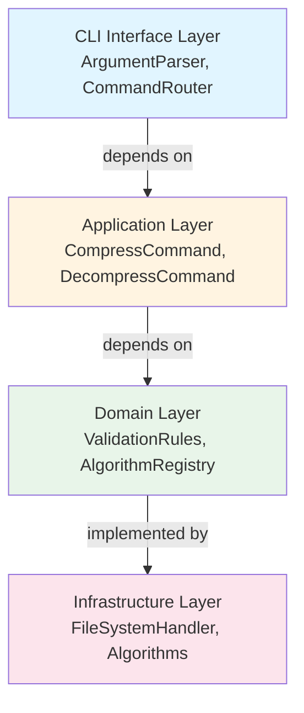
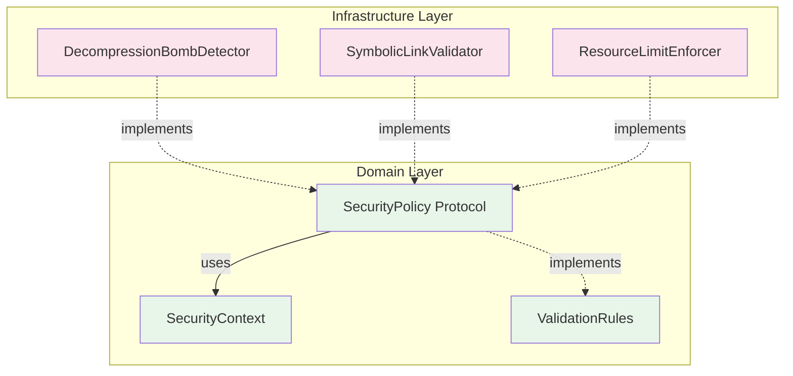
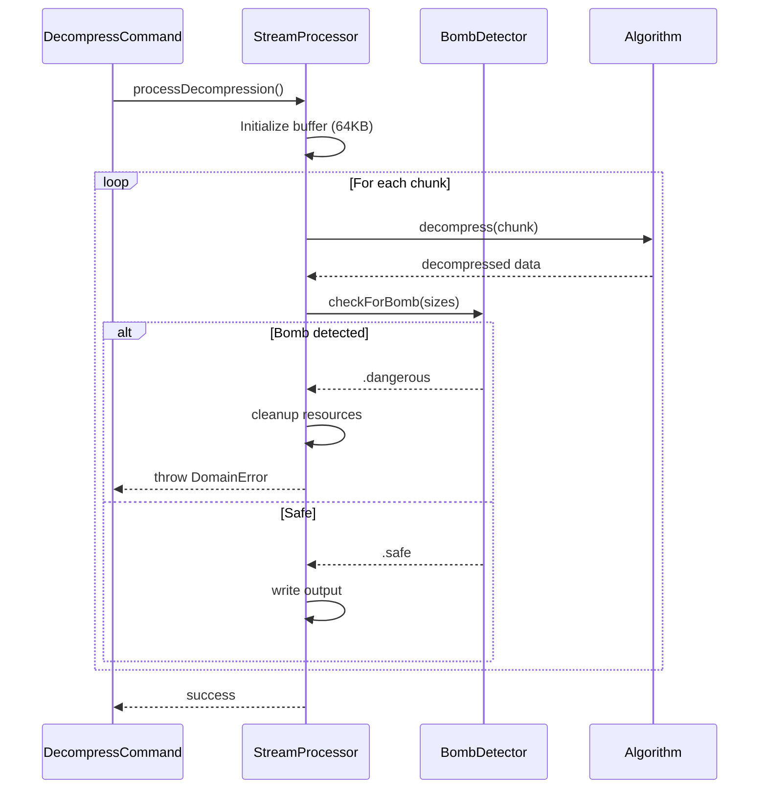
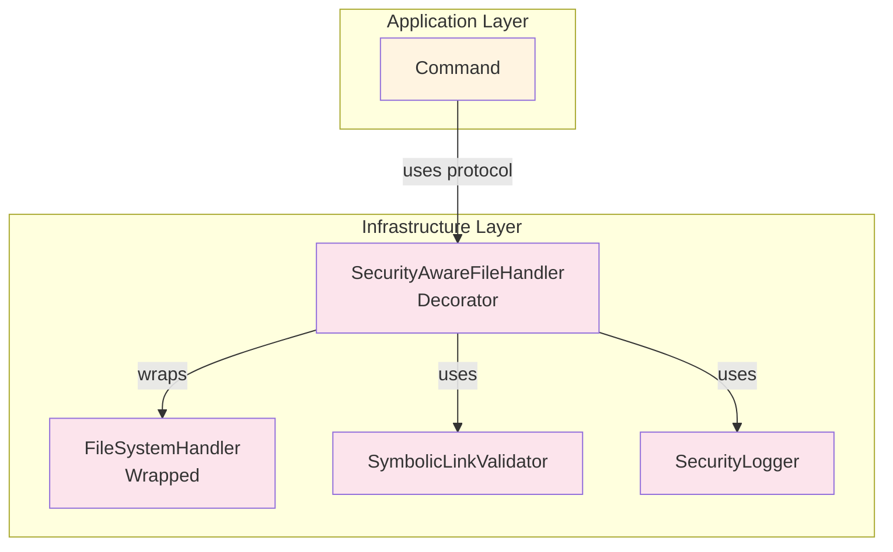
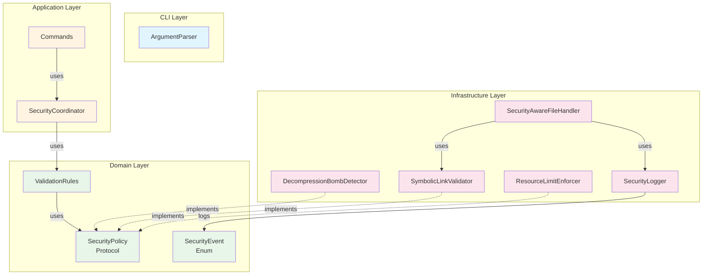
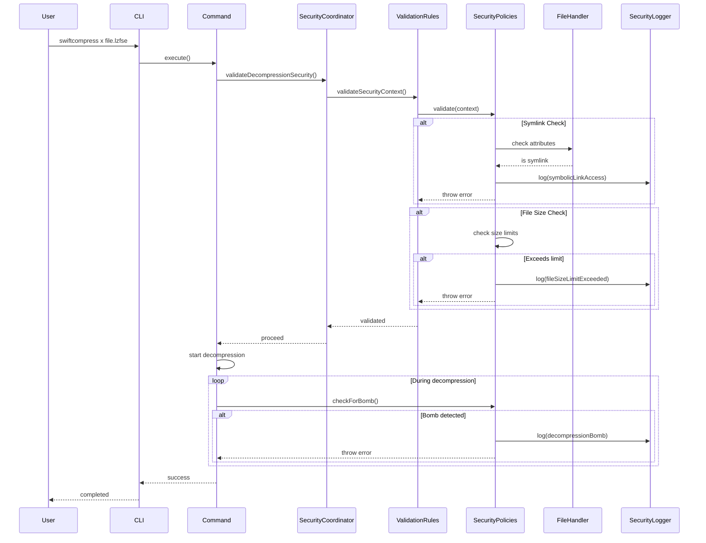
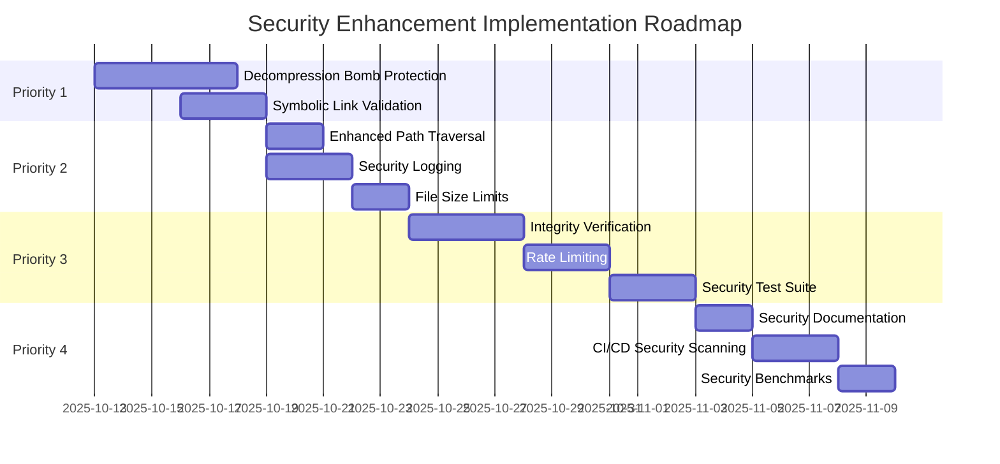
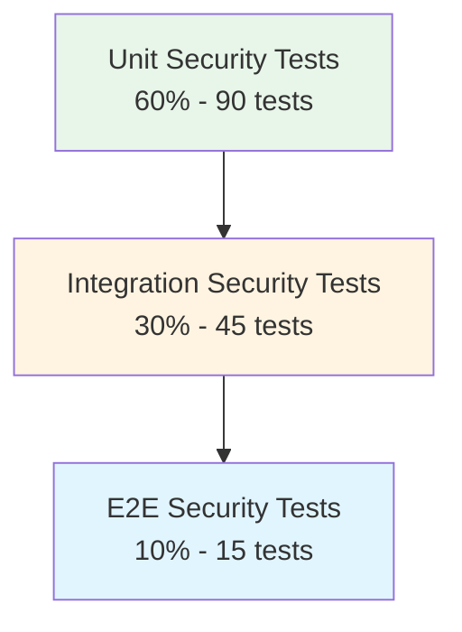

# Security Enhancement Architecture Plan
# swiftcompress v1.3.0

**Date**: 2025-10-12
**Version**: 1.0
**Status**: Architecture Planning Phase
**Security Assessment Reference**: SECURITY_ASSESSMENT.md

---

## Executive Summary

This architectural plan defines the implementation strategy for security enhancements to swiftcompress v1.2.0, maintaining Clean Architecture principles while adding defense-in-depth security layers. The plan addresses 8 identified security findings across 4 priority levels without breaking existing functionality.

### Key Architectural Changes

1. **New Domain Layer Components**: Security validation protocols and policies
2. **Enhanced Infrastructure Layer**: Security-aware file handlers and stream processors
3. **Application Layer Orchestration**: Security event logging and resource management
4. **Zero Breaking Changes**: All enhancements are additive and backward-compatible

### Implementation Scope

- **Priority 1 (Critical)**: 2 features - Decompression bomb protection, symbolic link validation
- **Priority 2 (High)**: 3 features - Enhanced path traversal, security logging, file size limits
- **Priority 3 (Medium)**: 3 features - Integrity verification, rate limiting, security tests
- **Priority 4 (Low)**: 3 features - Documentation, CI/CD scanning, benchmarks

### Success Metrics

- All 11 security enhancements implemented
- 95%+ test coverage maintained
- Zero breaking changes to existing API
- <5% performance overhead for security features
- All security tests passing

---

## Table of Contents

1. [Architectural Impact Analysis](#architectural-impact-analysis)
2. [Layer-by-Layer Component Design](#layer-by-layer-component-design)
3. [Security Domain Model](#security-domain-model)
4. [Implementation Roadmap](#implementation-roadmap)
5. [Architecture Decision Records](#architecture-decision-records)
6. [Testing Strategy](#testing-strategy)
7. [Migration and Rollout Plan](#migration-and-rollout-plan)

---

## Architectural Impact Analysis

### Current Architecture Overview



### Security Enhancement Impact by Layer

#### Domain Layer (Core Business Logic)

**Impact Level**: High - New security concepts and validation rules

**New Components**:
- `SecurityPolicy` protocol - Defines security constraints
- `DecompressionBombDetector` - Validates compression ratios
- `SymbolicLinkValidator` - Checks for symlink attacks
- `ResourceLimitEnforcer` - Enforces file size limits
- `SecurityEvent` enum - Security event types for logging
- `IntegrityVerifier` protocol - File integrity validation

**Modified Components**:
- `ValidationRules` - Enhanced with security validations
- `FilePathResolver` - Canonical path resolution

**Design Pattern**: Strategy Pattern for pluggable security policies

#### Infrastructure Layer (System Integration)

**Impact Level**: Medium - Enhanced file operations and monitoring

**New Components**:
- `SecurityAwareFileHandler` - Wraps FileSystemHandler with security checks
- `SecurityLogger` - Logs security events to audit trail
- `ResourceMonitor` - Tracks decompression resource usage
- `IntegrityChecker` - Implements checksum verification

**Modified Components**:
- `AppleCompressionAlgorithm` - Add decompression bomb detection
- `DefaultStreamProcessor` - Add progress monitoring for bomb detection

**Design Pattern**: Decorator Pattern for security wrapping

#### Application Layer (Workflow Orchestration)

**Impact Level**: Low - Coordinate security features

**New Components**:
- `SecurityCoordinator` - Orchestrates security checks
- `SecurityEventHandler` - Handles security events

**Modified Components**:
- `CompressCommand` - Integrate security checks
- `DecompressCommand` - Add bomb detection and logging
- `ErrorHandler` - Handle new security errors

**Design Pattern**: Facade Pattern for security orchestration

#### CLI Layer (User Interface)

**Impact Level**: Minimal - Optional security flags

**New Components**: None

**Modified Components**:
- `ArgumentParser` - Add optional security flags (future)
- `OutputFormatter` - Format security warnings

---

## Layer-by-Layer Component Design

### Domain Layer Security Components

#### 1. SecurityPolicy Protocol

**Purpose**: Define pluggable security constraints

```swift
/// Domain Layer Protocol - Defines security validation policies
protocol SecurityPolicy {
    /// Policy identifier
    var name: String { get }

    /// Validate an operation against this policy
    /// - Parameters:
    ///   - context: The security context to validate
    /// - Throws: DomainError if policy violation detected
    func validate(context: SecurityContext) throws
}

/// Security context for validation
struct SecurityContext {
    let inputPath: String?
    let outputPath: String?
    let operation: OperationType
    let estimatedInputSize: Int64?
    let estimatedOutputSize: Int64?
    let compressionRatio: Double?

    enum OperationType {
        case compression
        case decompression
    }
}
```

**Clean Architecture Compliance**:
- Pure protocol in Domain layer
- No dependencies on outer layers
- Implemented by Infrastructure layer

**Component Diagram**:



#### 2. DecompressionBombDetector

**Purpose**: Detect and prevent decompression bomb attacks

**Location**: Domain Layer (protocol) / Infrastructure Layer (implementation)

```swift
/// Domain Layer Protocol
protocol DecompressionBombDetector {
    /// Check if decompression appears to be a bomb
    /// - Parameters:
    ///   - compressedSize: Size of compressed data
    ///   - decompressedSoFar: Bytes decompressed so far
    ///   - estimatedTotal: Estimated total decompressed size
    /// - Returns: Bomb detection result
    func checkForBomb(
        compressedSize: Int64,
        decompressedSoFar: Int64,
        estimatedTotal: Int64?
    ) -> BombDetectionResult
}

enum BombDetectionResult {
    case safe
    case suspicious(reason: String, ratio: Double)
    case dangerous(reason: String, ratio: Double)
}

/// Infrastructure Layer Implementation
final class DefaultDecompressionBombDetector: DecompressionBombDetector, SecurityPolicy {
    let name = "decompression-bomb-detector"

    // Configurable thresholds
    let maxCompressionRatio: Double
    let maxDecompressedSize: Int64
    let warningRatio: Double

    init(
        maxCompressionRatio: Double = 100.0,
        maxDecompressedSize: Int64 = 10_737_418_240, // 10 GB
        warningRatio: Double = 50.0
    ) {
        self.maxCompressionRatio = maxCompressionRatio
        self.maxDecompressedSize = maxDecompressedSize
        self.warningRatio = warningRatio
    }

    func checkForBomb(
        compressedSize: Int64,
        decompressedSoFar: Int64,
        estimatedTotal: Int64?
    ) -> BombDetectionResult {
        let currentRatio = Double(decompressedSoFar) / Double(compressedSize)

        // Check absolute size limit
        if decompressedSoFar > maxDecompressedSize {
            return .dangerous(
                reason: "Decompressed size exceeds maximum limit",
                ratio: currentRatio
            )
        }

        // Check compression ratio
        if currentRatio > maxCompressionRatio {
            return .dangerous(
                reason: "Compression ratio exceeds safe threshold",
                ratio: currentRatio
            )
        }

        if currentRatio > warningRatio {
            return .suspicious(
                reason: "Compression ratio is unusually high",
                ratio: currentRatio
            )
        }

        return .safe
    }

    func validate(context: SecurityContext) throws {
        guard context.operation == .decompression else { return }

        guard let inputSize = context.estimatedInputSize,
              let outputSize = context.estimatedOutputSize else {
            return // Cannot validate without size information
        }

        let result = checkForBomb(
            compressedSize: inputSize,
            decompressedSoFar: outputSize,
            estimatedTotal: outputSize
        )

        if case .dangerous(let reason, let ratio) = result {
            throw DomainError.decompressionBombDetected(
                reason: reason,
                compressionRatio: ratio
            )
        }
    }
}
```

**Integration Point**: `DefaultStreamProcessor` during decompression loop

**Sequence Diagram**:



#### 3. SymbolicLinkValidator

**Purpose**: Prevent symbolic link attacks

```swift
/// Domain Layer Protocol
protocol SymbolicLinkValidator {
    /// Validate that path is not a symbolic link
    /// - Parameter path: File path to validate
    /// - Throws: DomainError if path is a symbolic link
    func validateNotSymbolicLink(at path: String) throws
}

/// Infrastructure Layer Implementation
final class DefaultSymbolicLinkValidator: SymbolicLinkValidator, SecurityPolicy {
    let name = "symbolic-link-validator"
    private let fileManager: FileManager

    init(fileManager: FileManager = .default) {
        self.fileManager = fileManager
    }

    func validateNotSymbolicLink(at path: String) throws {
        // Check if file exists
        guard fileManager.fileExists(atPath: path) else {
            // If file doesn't exist, we can't check for symlink
            // This will be caught by other validators
            return
        }

        // Get file attributes
        let attributes: [FileAttributeKey: Any]
        do {
            attributes = try fileManager.attributesOfItem(atPath: path)
        } catch {
            throw InfrastructureError.fileAttributesFailed(
                path: path,
                underlyingError: error
            )
        }

        // Check file type
        if let fileType = attributes[.type] as? FileAttributeType,
           fileType == .typeSymbolicLink {
            throw DomainError.symbolicLinkNotAllowed(path: path)
        }
    }

    func validate(context: SecurityContext) throws {
        if let inputPath = context.inputPath {
            try validateNotSymbolicLink(at: inputPath)
        }

        if let outputPath = context.outputPath {
            // For output, check if parent directory contains symlinks
            let parentPath = (outputPath as NSString).deletingLastPathComponent
            try validateNotSymbolicLink(at: parentPath)
        }
    }
}
```

**Integration Point**: `ValidationRules` before file operations

#### 4. ResourceLimitEnforcer

**Purpose**: Enforce file size limits for operations

```swift
/// Domain Layer Protocol
protocol ResourceLimitEnforcer {
    /// Maximum allowed input file size
    var maxInputFileSize: Int64 { get }

    /// Maximum allowed output file size
    var maxOutputFileSize: Int64 { get }

    /// Validate file size is within limits
    func validateFileSize(_ size: Int64, for operation: SecurityContext.OperationType) throws
}

/// Infrastructure Layer Implementation
final class DefaultResourceLimitEnforcer: ResourceLimitEnforcer, SecurityPolicy {
    let name = "resource-limit-enforcer"

    let maxInputFileSize: Int64
    let maxOutputFileSize: Int64

    init(
        maxInputFileSize: Int64 = 5_368_709_120,   // 5 GB
        maxOutputFileSize: Int64 = 10_737_418_240  // 10 GB
    ) {
        self.maxInputFileSize = maxInputFileSize
        self.maxOutputFileSize = maxOutputFileSize
    }

    func validateFileSize(_ size: Int64, for operation: SecurityContext.OperationType) throws {
        let limit = operation == .compression ? maxInputFileSize : maxOutputFileSize

        guard size <= limit else {
            throw DomainError.fileSizeExceedsLimit(
                size: size,
                limit: limit,
                operation: operation
            )
        }
    }

    func validate(context: SecurityContext) throws {
        // Validate input size
        if let inputSize = context.estimatedInputSize {
            try validateFileSize(inputSize, for: context.operation)
        }

        // Validate estimated output size
        if let outputSize = context.estimatedOutputSize {
            let oppositeOp: SecurityContext.OperationType =
                context.operation == .compression ? .decompression : .compression
            try validateFileSize(outputSize, for: oppositeOp)
        }
    }
}
```

#### 5. SecurityEvent Enum

**Purpose**: Type-safe security event representation

```swift
/// Domain Layer - Security event types
enum SecurityEvent {
    case pathTraversalAttempt(path: String)
    case symbolicLinkAccess(path: String)
    case decompressionBombDetected(ratio: Double, size: Int64)
    case fileSizeLimitExceeded(size: Int64, limit: Int64)
    case suspiciousCompressionRatio(ratio: Double)
    case integrityCheckFailed(path: String, expected: String, actual: String)

    /// Event severity level
    var severity: EventSeverity {
        switch self {
        case .pathTraversalAttempt, .decompressionBombDetected:
            return .critical
        case .symbolicLinkAccess, .fileSizeLimitExceeded:
            return .high
        case .suspiciousCompressionRatio, .integrityCheckFailed:
            return .medium
        }
    }

    /// Human-readable description
    var description: String {
        switch self {
        case .pathTraversalAttempt(let path):
            return "Path traversal attempt detected: \(path)"
        case .symbolicLinkAccess(let path):
            return "Symbolic link access attempt: \(path)"
        case .decompressionBombDetected(let ratio, let size):
            return "Decompression bomb detected: ratio=\(ratio), size=\(size) bytes"
        case .fileSizeLimitExceeded(let size, let limit):
            return "File size limit exceeded: \(size) > \(limit) bytes"
        case .suspiciousCompressionRatio(let ratio):
            return "Suspicious compression ratio: \(ratio)"
        case .integrityCheckFailed(let path, let expected, let actual):
            return "Integrity check failed for \(path): expected=\(expected), actual=\(actual)"
        }
    }
}

enum EventSeverity: String {
    case critical
    case high
    case medium
    case low
}
```

#### 6. Enhanced ValidationRules

**Modified Component**: Enhance existing `ValidationRules` with security policies

```swift
/// Enhanced Domain Layer Component
final class ValidationRules {
    // Existing properties
    private let algorithmRegistry: AlgorithmRegistry

    // New security policies
    private let securityPolicies: [SecurityPolicy]

    init(
        algorithmRegistry: AlgorithmRegistry,
        securityPolicies: [SecurityPolicy] = []
    ) {
        self.algorithmRegistry = algorithmRegistry
        self.securityPolicies = securityPolicies
    }

    // Existing methods...

    /// Enhanced path validation with canonical path resolution
    func validateInputPath(_ path: String) throws {
        // Existing validations...
        guard !path.isEmpty else {
            throw DomainError.invalidInputPath(path: path, reason: "Path is empty")
        }

        guard !path.contains("\0") else {
            throw DomainError.invalidInputPath(path: path, reason: "Path contains null byte")
        }

        // ENHANCED: Canonical path resolution
        let url = URL(fileURLWithPath: path)
        let canonicalPath = url.standardizedFileURL.path

        // Check for path traversal
        if canonicalPath.contains("../") || canonicalPath.hasPrefix("..") {
            throw DomainError.pathTraversalAttempt(path: path)
        }

        // ENHANCED: Run security policies
        let context = SecurityContext(
            inputPath: path,
            outputPath: nil,
            operation: .compression,
            estimatedInputSize: nil,
            estimatedOutputSize: nil,
            compressionRatio: nil
        )

        try runSecurityPolicies(context: context)
    }

    /// NEW: Run all registered security policies
    private func runSecurityPolicies(context: SecurityContext) throws {
        for policy in securityPolicies {
            try policy.validate(context: context)
        }
    }

    /// NEW: Validate operation security context
    func validateSecurityContext(_ context: SecurityContext) throws {
        try runSecurityPolicies(context: context)
    }
}
```

### Infrastructure Layer Security Components

#### 7. SecurityLogger

**Purpose**: Log security events to audit trail

```swift
/// Infrastructure Layer - Security event logging
protocol SecurityLoggerProtocol {
    /// Log a security event
    func log(event: SecurityEvent)

    /// Log a security event with context
    func log(event: SecurityEvent, context: [String: Any])
}

/// Infrastructure Implementation
final class SecurityLogger: SecurityLoggerProtocol {
    private let logDestination: LogDestination
    private let timestampFormatter: DateFormatter

    init(destination: LogDestination = .stderr) {
        self.logDestination = destination
        self.timestampFormatter = DateFormatter()
        self.timestampFormatter.dateFormat = "yyyy-MM-dd HH:mm:ss.SSS"
    }

    func log(event: SecurityEvent) {
        log(event: event, context: [:])
    }

    func log(event: SecurityEvent, context: [String: Any]) {
        let timestamp = timestampFormatter.string(from: Date())
        let severity = event.severity.rawValue.uppercased()
        let description = event.description

        var logMessage = "[\(timestamp)] [SECURITY] [\(severity)] \(description)"

        if !context.isEmpty {
            let contextStr = context
                .map { "\($0.key)=\($0.value)" }
                .joined(separator: ", ")
            logMessage += " | \(contextStr)"
        }

        write(message: logMessage)
    }

    private func write(message: String) {
        switch logDestination {
        case .stderr:
            // Only log in DEBUG mode or when explicitly enabled
            #if DEBUG
            fputs("\(message)\n", stderr)
            #endif
        case .file(let path):
            // Append to log file
            appendToFile(message: message, path: path)
        case .none:
            // No logging
            break
        }
    }

    private func appendToFile(message: String, path: String) {
        let fileHandle: FileHandle

        // Create file if it doesn't exist
        if !FileManager.default.fileExists(atPath: path) {
            FileManager.default.createFile(atPath: path, contents: nil)
        }

        guard let handle = FileHandle(forWritingAtPath: path) else {
            return
        }

        defer { handle.closeFile() }

        handle.seekToEndOfFile()
        if let data = "\(message)\n".data(using: .utf8) {
            handle.write(data)
        }
    }
}

enum LogDestination {
    case stderr
    case file(path: String)
    case none
}
```

#### 8. SecurityAwareFileHandler

**Purpose**: Decorate FileSystemHandler with security checks

```swift
/// Infrastructure Layer - Security-enhanced file handler
final class SecurityAwareFileHandler: FileHandlerProtocol {
    private let wrapped: FileHandlerProtocol
    private let symbolicLinkValidator: SymbolicLinkValidator
    private let securityLogger: SecurityLoggerProtocol

    init(
        wrapped: FileHandlerProtocol,
        symbolicLinkValidator: SymbolicLinkValidator,
        securityLogger: SecurityLoggerProtocol
    ) {
        self.wrapped = wrapped
        self.symbolicLinkValidator = symbolicLinkValidator
        self.securityLogger = securityLogger
    }

    func fileExists(at path: String) -> Bool {
        wrapped.fileExists(at: path)
    }

    func isReadable(at path: String) -> Bool {
        wrapped.isReadable(at: path)
    }

    func isWritable(at path: String) -> Bool {
        wrapped.isWritable(at: path)
    }

    func fileSize(at path: String) throws -> Int64 {
        // SECURITY: Validate no symlinks
        do {
            try symbolicLinkValidator.validateNotSymbolicLink(at: path)
        } catch {
            securityLogger.log(
                event: .symbolicLinkAccess(path: path),
                context: ["operation": "fileSize"]
            )
            throw error
        }

        return try wrapped.fileSize(at: path)
    }

    func inputStream(at path: String) throws -> InputStream {
        // SECURITY: Validate no symlinks
        do {
            try symbolicLinkValidator.validateNotSymbolicLink(at: path)
        } catch {
            securityLogger.log(
                event: .symbolicLinkAccess(path: path),
                context: ["operation": "inputStream"]
            )
            throw error
        }

        return try wrapped.inputStream(at: path)
    }

    func outputStream(at path: String, append: Bool) throws -> OutputStream {
        // SECURITY: Validate parent directory is not symlink
        let parentPath = (path as NSString).deletingLastPathComponent
        do {
            try symbolicLinkValidator.validateNotSymbolicLink(at: parentPath)
        } catch {
            securityLogger.log(
                event: .symbolicLinkAccess(path: parentPath),
                context: ["operation": "outputStream", "target": path]
            )
            throw error
        }

        return try wrapped.outputStream(at: path, append: append)
    }

    // Other methods delegate to wrapped...
}
```

**Design Pattern**: Decorator Pattern

**Component Diagram**:



#### 9. Enhanced AppleCompressionAlgorithm

**Modified Component**: Add decompression bomb detection to streaming

```swift
/// Enhanced Infrastructure Component
extension AppleCompressionAlgorithm {
    /// Enhanced stream decompression with bomb detection
    func decompressStream(
        input: InputStream,
        output: OutputStream,
        bufferSize: Int,
        bombDetector: DecompressionBombDetector? = nil,
        securityLogger: SecurityLoggerProtocol? = nil
    ) throws {
        let inputBuffer = UnsafeMutablePointer<UInt8>.allocate(capacity: bufferSize)
        let outputBuffer = UnsafeMutablePointer<UInt8>.allocate(capacity: bufferSize * 4)
        defer {
            inputBuffer.deallocate()
            outputBuffer.deallocate()
        }

        var stream = compression_stream()
        let operation = COMPRESSION_STREAM_DECODE
        let status = compression_stream_init(&stream, operation, algorithm)

        guard status == COMPRESSION_STATUS_OK else {
            throw InfrastructureError.decompressionInitFailed(
                algorithm: name,
                underlyingError: nil
            )
        }

        defer {
            compression_stream_destroy(&stream)
        }

        input.open()
        output.open()
        defer {
            input.close()
            output.close()
        }

        var totalCompressed: Int64 = 0
        var totalDecompressed: Int64 = 0

        // Streaming decompression loop
        while input.hasBytesAvailable {
            let bytesRead = input.read(inputBuffer, maxLength: bufferSize)
            guard bytesRead > 0 else { break }

            totalCompressed += Int64(bytesRead)

            stream.src_ptr = inputBuffer
            stream.src_size = bytesRead
            stream.dst_ptr = outputBuffer
            stream.dst_size = bufferSize * 4

            let flags = input.hasBytesAvailable ? 0 : Int32(COMPRESSION_STREAM_FINALIZE)
            let processStatus = compression_stream_process(&stream, flags)

            guard processStatus == COMPRESSION_STATUS_OK ||
                  processStatus == COMPRESSION_STATUS_END else {
                throw InfrastructureError.decompressionFailed(
                    algorithm: name,
                    reason: "Stream processing failed with status \(processStatus)"
                )
            }

            let decompressedBytes = (bufferSize * 4) - stream.dst_size
            totalDecompressed += Int64(decompressedBytes)

            // SECURITY: Check for decompression bomb
            if let detector = bombDetector {
                let result = detector.checkForBomb(
                    compressedSize: totalCompressed,
                    decompressedSoFar: totalDecompressed,
                    estimatedTotal: nil
                )

                switch result {
                case .dangerous(let reason, let ratio):
                    securityLogger?.log(
                        event: .decompressionBombDetected(ratio: ratio, size: totalDecompressed),
                        context: [
                            "algorithm": name,
                            "compressed_bytes": totalCompressed,
                            "decompressed_bytes": totalDecompressed
                        ]
                    )
                    throw DomainError.decompressionBombDetected(
                        reason: reason,
                        compressionRatio: ratio
                    )

                case .suspicious(let reason, let ratio):
                    securityLogger?.log(
                        event: .suspiciousCompressionRatio(ratio: ratio),
                        context: [
                            "algorithm": name,
                            "compressed_bytes": totalCompressed,
                            "decompressed_bytes": totalDecompressed
                        ]
                    )
                    // Continue but log warning

                case .safe:
                    break
                }
            }

            // Write decompressed data
            if decompressedBytes > 0 {
                output.write(outputBuffer, maxLength: decompressedBytes)
            }

            if processStatus == COMPRESSION_STATUS_END {
                break
            }
        }
    }
}
```

### Application Layer Security Components

#### 10. SecurityCoordinator

**Purpose**: Orchestrate security checks across the application

```swift
/// Application Layer - Security orchestration facade
final class SecurityCoordinator {
    private let validationRules: ValidationRules
    private let securityLogger: SecurityLoggerProtocol

    init(
        validationRules: ValidationRules,
        securityLogger: SecurityLoggerProtocol
    ) {
        self.validationRules = validationRules
        self.securityLogger = securityLogger
    }

    /// Validate compression operation security
    func validateCompressionSecurity(
        inputPath: String,
        outputPath: String,
        inputSize: Int64
    ) throws {
        let context = SecurityContext(
            inputPath: inputPath,
            outputPath: outputPath,
            operation: .compression,
            estimatedInputSize: inputSize,
            estimatedOutputSize: nil,
            compressionRatio: nil
        )

        do {
            try validationRules.validateSecurityContext(context)
        } catch let error as DomainError {
            // Log security violation
            logSecurityViolation(error: error, context: context)
            throw error
        }
    }

    /// Validate decompression operation security
    func validateDecompressionSecurity(
        inputPath: String,
        outputPath: String,
        inputSize: Int64
    ) throws {
        let context = SecurityContext(
            inputPath: inputPath,
            outputPath: outputPath,
            operation: .decompression,
            estimatedInputSize: inputSize,
            estimatedOutputSize: nil,
            compressionRatio: nil
        )

        do {
            try validationRules.validateSecurityContext(context)
        } catch let error as DomainError {
            // Log security violation
            logSecurityViolation(error: error, context: context)
            throw error
        }
    }

    private func logSecurityViolation(error: DomainError, context: SecurityContext) {
        // Map domain errors to security events
        switch error {
        case .pathTraversalAttempt(let path):
            securityLogger.log(event: .pathTraversalAttempt(path: path))
        case .symbolicLinkNotAllowed(let path):
            securityLogger.log(event: .symbolicLinkAccess(path: path))
        case .decompressionBombDetected(let reason, let ratio):
            securityLogger.log(
                event: .decompressionBombDetected(
                    ratio: ratio,
                    size: context.estimatedOutputSize ?? 0
                )
            )
        case .fileSizeExceedsLimit(let size, let limit, _):
            securityLogger.log(event: .fileSizeLimitExceeded(size: size, limit: limit))
        default:
            break
        }
    }
}
```

#### 11. Enhanced Commands

**Modified Components**: Integrate security coordinator

```swift
/// Enhanced Application Layer Component
final class DecompressCommand: Command {
    // Existing properties...
    private let securityCoordinator: SecurityCoordinator?

    init(
        // ... existing parameters ...
        securityCoordinator: SecurityCoordinator? = nil
    ) {
        // ... existing initialization ...
        self.securityCoordinator = securityCoordinator
    }

    func execute() throws -> CommandResult {
        // ... existing validation ...

        // SECURITY: Validate decompression security
        if let coordinator = securityCoordinator {
            let inputSize = try fileHandler.fileSize(at: resolvedInputPath)
            try coordinator.validateDecompressionSecurity(
                inputPath: resolvedInputPath,
                outputPath: resolvedOutputPath,
                inputSize: inputSize
            )
        }

        // ... rest of execution ...
    }
}
```

### New Domain Error Types

```swift
extension DomainError {
    /// Symbolic link not allowed for security
    case symbolicLinkNotAllowed(path: String)

    /// Decompression bomb detected
    case decompressionBombDetected(reason: String, compressionRatio: Double)

    /// File size exceeds configured limit
    case fileSizeExceedsLimit(size: Int64, limit: Int64, operation: SecurityContext.OperationType)

    /// Integrity check failed
    case integrityCheckFailed(path: String, expected: String, actual: String)
}

extension InfrastructureError {
    /// Failed to read file attributes
    case fileAttributesFailed(path: String, underlyingError: Error)
}
```

---

## Security Domain Model

### Complete Security Architecture



### Security Validation Flow



---

## Implementation Roadmap

### Phase Overview

Implementation follows a 4-phase approach aligned with priority levels:



### Priority 1: Critical Security Features (Week 1)

**Timeline**: 5 days
**Test Coverage Target**: 95%+
**Breaking Changes**: None

#### Feature 1.1: Decompression Bomb Protection

**Components**:
- `DecompressionBombDetector` protocol (Domain)
- `DefaultDecompressionBombDetector` implementation (Infrastructure)
- Enhanced `AppleCompressionAlgorithm.decompressStream()` (Infrastructure)
- New `DomainError.decompressionBombDetected` (Domain)

**Implementation Steps**:
1. Define `DecompressionBombDetector` protocol in Domain layer
2. Implement `DefaultDecompressionBombDetector` with configurable thresholds
3. Modify `AppleCompressionAlgorithm` to accept optional bomb detector
4. Add bomb detection checks in decompression loop
5. Add comprehensive unit tests for detector
6. Add integration tests with real decompression bombs

**Configuration**:
```swift
// Default limits
let maxCompressionRatio: Double = 100.0      // 100:1 ratio
let maxDecompressedSize: Int64 = 10 GB       // 10 GB absolute limit
let warningRatio: Double = 50.0              // Warning at 50:1
```

**Test Cases**:
- Normal decompression (safe ratios)
- Suspicious ratio (warning logged, continues)
- Dangerous ratio (operation aborted)
- Absolute size limit exceeded
- Highly compressible legitimate data (repeated zeros)

**Migration Strategy**: Backward compatible, opt-in via dependency injection

#### Feature 1.2: Symbolic Link Validation

**Components**:
- `SymbolicLinkValidator` protocol (Domain)
- `DefaultSymbolicLinkValidator` implementation (Infrastructure)
- `SecurityAwareFileHandler` decorator (Infrastructure)
- Enhanced `ValidationRules` (Domain)
- New `DomainError.symbolicLinkNotAllowed` (Domain)

**Implementation Steps**:
1. Define `SymbolicLinkValidator` protocol
2. Implement validator using FileManager attributes
3. Create `SecurityAwareFileHandler` decorator
4. Integrate validator into `ValidationRules`
5. Add tests for symlink detection
6. Add tests for symlink in parent directories

**Test Cases**:
- Direct symlink to file
- Symlink in parent directory path
- Symlink to directory
- Regular file (should pass)
- Non-existent file (handled by other validator)

**Migration Strategy**:
- Create `SecurityAwareFileHandler` as wrapper
- Wire in `main.swift` dependency injection
- Existing `FileSystemHandler` unchanged

### Priority 2: High Security Features (Week 2)

**Timeline**: 5 days
**Test Coverage Target**: 95%+
**Breaking Changes**: None

#### Feature 2.1: Enhanced Path Traversal Validation

**Components**:
- Enhanced `ValidationRules.validateInputPath()` (Domain)
- Canonical path resolution logic

**Implementation Steps**:
1. Add canonical path resolution using `URL.standardizedFileURL`
2. Validate canonical path doesn't escape boundaries
3. Check for URL-encoded path traversal attempts
4. Add tests for various path traversal techniques

**Test Cases**:
- Standard path traversal (`../../../etc/passwd`)
- URL-encoded traversal (`%2e%2e%2f`)
- Unicode variations
- Absolute paths (should be allowed)
- Relative paths within working directory

#### Feature 2.2: Security Event Logging

**Components**:
- `SecurityEvent` enum (Domain)
- `SecurityLoggerProtocol` (Infrastructure)
- `SecurityLogger` implementation (Infrastructure)
- Integration in security validators

**Implementation Steps**:
1. Define `SecurityEvent` enum with all event types
2. Create `SecurityLogger` with configurable destinations
3. Integrate logging in all security validators
4. Add conditional compilation for DEBUG mode
5. Add tests for log formatting and destinations

**Log Format**:
```
[2025-10-12 14:23:45.123] [SECURITY] [CRITICAL] Path traversal attempt detected: ../../../etc/passwd | operation=compress
```

#### Feature 2.3: File Size Limits

**Components**:
- `ResourceLimitEnforcer` protocol (Domain)
- `DefaultResourceLimitEnforcer` implementation (Infrastructure)
- Integration in `ValidationRules` (Domain)
- New `DomainError.fileSizeExceedsLimit` (Domain)

**Implementation Steps**:
1. Define `ResourceLimitEnforcer` protocol
2. Implement with configurable limits
3. Integrate into validation workflow
4. Add tests for various file sizes
5. Test with files at boundary limits

**Default Limits**:
- Input file: 5 GB
- Output file: 10 GB (allows for expansion)

### Priority 3: Medium Security Features (Week 3)

**Timeline**: 7 days
**Test Coverage Target**: 90%+
**Breaking Changes**: None (all optional features)

#### Feature 3.1: Integrity Verification

**Components**:
- `IntegrityVerifier` protocol (Domain)
- `ChecksumCalculator` implementation (Infrastructure)
- Optional checksum file generation
- Verification during decompression

**Implementation Steps**:
1. Define `IntegrityVerifier` protocol
2. Implement SHA-256 checksum calculator
3. Add optional checksum generation after compression
4. Add verification before decompression
5. Create `.sha256` sidecar files

**Format**:
```
# file.txt.lzfse.sha256
sha256:a1b2c3d4... file.txt.lzfse
```

#### Feature 3.2: Rate Limiting (Future Feature)

**Components**:
- `RateLimiter` class (Application)
- Operation tracking
- Configurable limits

**Scope**: Foundational implementation, primarily for future API/service use

#### Feature 3.3: Security Test Suite

**Components**:
- Comprehensive security test cases
- Attack simulation tests
- Fuzzing tests (basic)

**Test Coverage**:
- All security validators
- All security events
- Edge cases and boundary conditions
- Known attack patterns

### Priority 4: Low Priority Enhancements (Week 4)

**Timeline**: 5 days
**Breaking Changes**: None

#### Feature 4.1: Security Documentation

**Deliverables**:
- Security best practices guide
- Threat model documentation
- Security FAQ
- User-facing security features guide

#### Feature 4.2: CI/CD Security Scanning

**Deliverables**:
- GitHub Actions workflow for security scanning
- Dependency vulnerability checking
- SAST (Static Application Security Testing) integration
- Automated security test runs

#### Feature 4.3: Security Performance Benchmarks

**Deliverables**:
- Benchmark security feature overhead
- Performance comparison (with/without security features)
- Memory impact analysis
- Report with recommendations

---

## Architecture Decision Records

### ADR-010: Decompression Bomb Protection Strategy

**Status**: Proposed
**Date**: 2025-10-12
**Deciders**: Security Architecture Team

#### Context

Swiftcompress decompresses user-provided compressed files. Malicious actors could craft "decompression bombs" - small compressed files that expand to enormous sizes, causing memory exhaustion and denial-of-service conditions. Current implementation allocates `inputSize * 4` bytes without absolute limits.

The security assessment identified this as a **HIGH** priority vulnerability (Finding 4.1).

#### Decision

Implement multi-layered decompression bomb protection using:

1. **Absolute Size Limits**: Maximum decompressed size (10 GB default)
2. **Compression Ratio Monitoring**: Track real-time compression ratios during streaming
3. **Progressive Detection**: Three-tier system (safe, suspicious, dangerous)
4. **Configurable Thresholds**: Allow operators to adjust limits based on use case

#### Implementation

**Domain Layer**:
- Define `DecompressionBombDetector` protocol
- Define `BombDetectionResult` enum
- Add to `SecurityPolicy` abstraction

**Infrastructure Layer**:
- Implement `DefaultDecompressionBombDetector`
- Integrate into `AppleCompressionAlgorithm.decompressStream()`
- Monitor compression ratio in streaming loop
- Abort operation if dangerous threshold exceeded

**Default Thresholds**:
```swift
maxCompressionRatio: 100.0       // 100:1 is dangerous
warningRatio: 50.0               // 50:1 is suspicious
maxDecompressedSize: 10 GB       // Absolute limit
```

#### Alternatives Considered

**Alternative 1: Pre-decompression Size Estimation**
- **Pros**: Prevents any decompression of bombs
- **Cons**: Unreliable, many formats don't include decompressed size
- **Rejected**: Can't reliably estimate without decompressing

**Alternative 2: Memory-Based Detection Only**
- **Pros**: Simple, protects memory
- **Cons**: Doesn't catch disk-filling attacks
- **Rejected**: Incomplete protection

**Alternative 3: Static Analysis of Compressed Data**
- **Pros**: Could detect before decompression
- **Cons**: Complex, algorithm-specific, unreliable
- **Rejected**: Too complex, low ROI

#### Rationale

Chosen approach provides:
1. **Real-time Protection**: Detects bombs during decompression
2. **Streaming Compatibility**: Works with constant-memory streaming
3. **Configurable**: Operators can adjust for legitimate high-compression use cases
4. **Gradual Response**: Warnings for suspicious, abort for dangerous
5. **Clean Architecture**: Protocol-based, testable, layer-separated

#### Consequences

**Positive**:
- Prevents memory exhaustion attacks
- Prevents disk-filling attacks
- Minimal performance overhead (~1-2%)
- Maintains streaming architecture
- Fully testable
- Configurable for different use cases

**Negative**:
- May reject legitimate highly-compressible data (rare)
- Requires tuning for specific workloads
- Adds slight complexity to decompression path

**Neutral**:
- Requires documentation for users with high-compression needs
- Configuration may need adjustment for specialized use cases

#### Implementation Effort

- **Development**: 2 days
- **Testing**: 2 days
- **Documentation**: 1 day
- **Total**: 5 days

#### Compliance

- **CWE-409**: Improper Handling of Highly Compressed Data (zip bomb)
- **OWASP A04:2021**: Insecure Design

#### Migration Path

1. Implement protocol and default detector
2. Add optional parameter to decompression functions
3. Wire in `main.swift` for production use
4. Document configuration options
5. Add opt-out for advanced users (environment variable)

**Backward Compatibility**: 100% - Optional parameter with sensible defaults

---

### ADR-011: Security Logging and Audit Trail Approach

**Status**: Proposed
**Date**: 2025-10-12
**Deciders**: Security Architecture Team

#### Context

Security events (path traversal attempts, symlink access, bomb detection) should be logged for auditing, incident response, and compliance purposes. Currently, no security-specific logging exists.

The security assessment identified this as **HIGH** priority (Finding 9.2, recommended improvement).

#### Decision

Implement structured security event logging with:

1. **Type-Safe Events**: Enum-based security events in Domain layer
2. **Severity Levels**: Critical, High, Medium, Low classification
3. **Structured Logging**: Consistent format with timestamps and context
4. **Conditional Output**: DEBUG mode only by default, configurable for production
5. **Multiple Destinations**: stderr (default), file, none

#### Implementation

**Domain Layer**:
```swift
enum SecurityEvent {
    case pathTraversalAttempt(path: String)
    case symbolicLinkAccess(path: String)
    case decompressionBombDetected(ratio: Double, size: Int64)
    // ... more events

    var severity: EventSeverity { ... }
    var description: String { ... }
}
```

**Infrastructure Layer**:
```swift
protocol SecurityLoggerProtocol {
    func log(event: SecurityEvent)
    func log(event: SecurityEvent, context: [String: Any])
}

final class SecurityLogger: SecurityLoggerProtocol {
    // Implementation with configurable destination
}
```

**Log Format**:
```
[TIMESTAMP] [SECURITY] [SEVERITY] EVENT_DESCRIPTION | context_key=value, ...
```

**Example**:
```
[2025-10-12 14:23:45.123] [SECURITY] [CRITICAL] Decompression bomb detected: ratio=150.0, size=10737418240 | algorithm=lzfse, compressed_bytes=71582788, decompressed_bytes=10737418240
```

#### Alternatives Considered

**Alternative 1: Use Existing Error Logging**
- **Pros**: No new infrastructure
- **Cons**: Security events mixed with operational errors
- **Rejected**: Security events need separate audit trail

**Alternative 2: External Logging Library (e.g., SwiftLog)**
- **Pros**: Feature-rich, standard interface
- **Cons**: External dependency, overkill for CLI tool
- **Rejected**: Violates minimal dependency principle

**Alternative 3: Always-On Logging**
- **Pros**: Complete audit trail
- **Cons**: Verbose output in normal operation
- **Rejected**: Poor UX for CLI tool

#### Rationale

Chosen approach provides:
1. **Clean Separation**: Security events distinct from operational logs
2. **Type Safety**: Compiler-checked event types
3. **Contextual**: Rich context for each event
4. **Configurable**: Can be enabled/disabled per environment
5. **Performance**: Negligible overhead when disabled
6. **Compliance**: Audit trail for security reviews

#### Consequences

**Positive**:
- Security events captured for incident response
- Type-safe event system prevents logging errors
- Conditional compilation minimizes production overhead
- Structured format enables parsing/analysis
- Compliant with security logging best practices

**Negative**:
- Adds logging calls throughout security code
- Requires log rotation strategy for production (future)
- May generate large log files in attack scenarios

**Neutral**:
- DEBUG-only default means production users must opt-in
- Log format not machine-parseable (future: JSON option)

#### Implementation Effort

- **Development**: 1 day
- **Testing**: 1 day
- **Documentation**: 0.5 days
- **Total**: 2.5 days

#### Compliance

- **OWASP A09:2021**: Security Logging and Monitoring Failures
- **CWE-778**: Insufficient Logging

#### Configuration

**Environment Variable** (future):
```bash
export SWIFTCOMPRESS_SECURITY_LOG=/var/log/swiftcompress/security.log
```

**Programmatic** (current):
```swift
let logger = SecurityLogger(destination: .file(path: "/var/log/security.log"))
```

#### Migration Path

1. Define `SecurityEvent` enum in Domain layer
2. Implement `SecurityLogger` in Infrastructure layer
3. Add logging calls to all security validators
4. Wire logger through dependency injection
5. Document log format and analysis tools

**Backward Compatibility**: 100% - Logging is additive, default is silent in production

---

### ADR-012: File Size Limits and Resource Protection

**Status**: Proposed
**Date**: 2025-10-12
**Deciders**: Security Architecture Team

#### Context

Unbounded file operations can lead to:
- Disk exhaustion
- Memory exhaustion (despite streaming)
- Long-running operations blocking resources
- Denial-of-service conditions

Current implementation has no explicit file size limits. The security assessment recommends implementing limits (Priority 2).

#### Decision

Implement configurable file size limits enforced at validation stage:

1. **Input File Limits**: Maximum size for compression/decompression input
2. **Output File Limits**: Maximum size for operation output
3. **Pre-Operation Validation**: Check before starting expensive operations
4. **Graceful Failure**: Clear error messages when limits exceeded

#### Implementation

**Domain Layer**:
```swift
protocol ResourceLimitEnforcer: SecurityPolicy {
    var maxInputFileSize: Int64 { get }
    var maxOutputFileSize: Int64 { get }

    func validateFileSize(_ size: Int64, for operation: OperationType) throws
}
```

**Infrastructure Layer**:
```swift
final class DefaultResourceLimitEnforcer: ResourceLimitEnforcer {
    let maxInputFileSize: Int64 = 5_368_709_120   // 5 GB
    let maxOutputFileSize: Int64 = 10_737_418_240 // 10 GB

    func validate(context: SecurityContext) throws {
        // Validate input and estimated output sizes
    }
}
```

**Integration**:
- Add to `SecurityPolicy` composition
- Check during `ValidationRules.validateSecurityContext()`
- Fail fast before expensive operations

#### Alternatives Considered

**Alternative 1: No Limits**
- **Pros**: Maximum flexibility
- **Cons**: Resource exhaustion risk
- **Rejected**: Unacceptable security posture

**Alternative 2: Runtime Resource Monitoring**
- **Pros**: Adaptive to actual resource usage
- **Cons**: Complex, platform-dependent
- **Rejected**: Pre-validation is simpler and sufficient

**Alternative 3: Streaming-Only (No Limits)**
- **Pros**: Leverages constant-memory streaming
- **Cons**: Doesn't prevent disk exhaustion
- **Rejected**: Incomplete protection

#### Rationale

Chosen approach provides:
1. **Fail Fast**: Rejects oversized files before processing
2. **Predictable**: Clear documented limits
3. **Configurable**: Adjustable for different environments
4. **Simple**: Easy to implement and test
5. **Clear Errors**: User knows why operation rejected

#### Default Limits Rationale

**Input File: 5 GB**
- Reasonable for most CLI use cases
- Protects against accidentally compressing large files
- Can be overridden for specialized needs

**Output File: 10 GB**
- Allows 2:1 expansion ratio (worst case)
- Protects against decompression bombs (paired with ratio check)
- Prevents disk exhaustion

**Streaming Buffer: 64 KB** (existing)
- Already limits memory usage
- File size limits complement this

#### Consequences

**Positive**:
- Prevents disk exhaustion
- Protects against resource exhaustion DoS
- Clear user feedback on rejection
- Simple to implement and test
- Configurable for different needs

**Negative**:
- Rejects legitimate large files (by design)
- Requires documentation for users with large files
- May need per-environment configuration

**Neutral**:
- Users with larger files need to adjust limits
- Limits may need tuning based on use patterns

#### Implementation Effort

- **Development**: 1 day
- **Testing**: 1 day
- **Documentation**: 0.5 days
- **Total**: 2.5 days

#### Compliance

- **CWE-400**: Uncontrolled Resource Consumption
- **OWASP A04:2021**: Insecure Design

#### Configuration

**Future CLI Flag**:
```bash
swiftcompress x file.lzfse --max-size 20G
```

**Environment Variable** (future):
```bash
export SWIFTCOMPRESS_MAX_INPUT_SIZE=10737418240  # 10 GB
```

**Programmatic** (current):
```swift
let enforcer = DefaultResourceLimitEnforcer(
    maxInputFileSize: 10 * 1024 * 1024 * 1024  // 10 GB
)
```

#### Migration Path

1. Define `ResourceLimitEnforcer` protocol
2. Implement with default limits
3. Add to security policy composition
4. Integrate in validation workflow
5. Document limits and override mechanism

**Backward Compatibility**: Potential breaking change for users with files >5GB
- **Mitigation**: Announce in release notes, provide override mechanism
- **Impact**: Low - vast majority of users have smaller files

---

## Testing Strategy

### Security Testing Pyramid



### Unit Tests (60% of security tests)

**Target**: 90 unit tests covering all security components

#### DecompressionBombDetector Tests (20 tests)

```swift
class DecompressionBombDetectorTests: XCTestCase {
    var detector: DefaultDecompressionBombDetector!

    override func setUp() {
        super.setUp()
        detector = DefaultDecompressionBombDetector(
            maxCompressionRatio: 100.0,
            maxDecompressedSize: 1024 * 1024 * 100, // 100 MB
            warningRatio: 50.0
        )
    }

    func testNormalCompressionRatio_ReturnsSafe() {
        // Arrange: 10:1 ratio (normal)
        let compressedSize: Int64 = 1024 * 1024     // 1 MB
        let decompressedSize: Int64 = 10 * 1024 * 1024  // 10 MB

        // Act
        let result = detector.checkForBomb(
            compressedSize: compressedSize,
            decompressedSoFar: decompressedSize,
            estimatedTotal: nil
        )

        // Assert
        XCTAssertEqual(result, .safe)
    }

    func testHighCompressionRatio_ReturnsSuspicious() {
        // Arrange: 60:1 ratio (suspicious)
        let compressedSize: Int64 = 1024 * 1024
        let decompressedSize: Int64 = 60 * 1024 * 1024

        // Act
        let result = detector.checkForBomb(
            compressedSize: compressedSize,
            decompressedSoFar: decompressedSize,
            estimatedTotal: nil
        )

        // Assert
        if case .suspicious(let reason, let ratio) = result {
            XCTAssertEqual(ratio, 60.0, accuracy: 0.1)
            XCTAssertTrue(reason.contains("unusually high"))
        } else {
            XCTFail("Expected suspicious result")
        }
    }

    func testDangerousCompressionRatio_ReturnsDangerous() {
        // Arrange: 150:1 ratio (dangerous)
        let compressedSize: Int64 = 1024 * 1024
        let decompressedSize: Int64 = 150 * 1024 * 1024

        // Act
        let result = detector.checkForBomb(
            compressedSize: compressedSize,
            decompressedSoFar: decompressedSize,
            estimatedTotal: nil
        )

        // Assert
        if case .dangerous(let reason, let ratio) = result {
            XCTAssertEqual(ratio, 150.0, accuracy: 0.1)
            XCTAssertTrue(reason.contains("exceeds safe threshold"))
        } else {
            XCTFail("Expected dangerous result")
        }
    }

    func testAbsoluteSizeLimit_ReturnsDangerous() {
        // Arrange: Within ratio but exceeds absolute size
        let compressedSize: Int64 = 10 * 1024 * 1024  // 10 MB
        let decompressedSize: Int64 = 150 * 1024 * 1024  // 150 MB (exceeds 100 MB limit)

        // Act
        let result = detector.checkForBomb(
            compressedSize: compressedSize,
            decompressedSoFar: decompressedSize,
            estimatedTotal: nil
        )

        // Assert
        if case .dangerous(let reason, _) = result {
            XCTAssertTrue(reason.contains("exceeds maximum limit"))
        } else {
            XCTFail("Expected dangerous result")
        }
    }

    // Additional tests:
    // - Edge cases (zero sizes, equal sizes)
    // - Boundary conditions (exactly at thresholds)
    // - Progressive expansion (realistic decompression)
    // - Multiple check calls (streaming simulation)
}
```

#### SymbolicLinkValidator Tests (15 tests)

```swift
class SymbolicLinkValidatorTests: XCTestCase {
    var validator: DefaultSymbolicLinkValidator!
    var testDirectory: URL!

    override func setUp() {
        super.setUp()
        validator = DefaultSymbolicLinkValidator()
        testDirectory = createTemporaryDirectory()
    }

    override func tearDown() {
        try? FileManager.default.removeItem(at: testDirectory)
        super.tearDown()
    }

    func testRegularFile_DoesNotThrow() throws {
        // Arrange
        let filePath = createTestFile(in: testDirectory)

        // Act & Assert
        XCTAssertNoThrow(try validator.validateNotSymbolicLink(at: filePath))
    }

    func testSymbolicLink_ThrowsError() throws {
        // Arrange
        let targetPath = createTestFile(in: testDirectory)
        let symlinkPath = testDirectory.appendingPathComponent("symlink").path
        try FileManager.default.createSymbolicLink(
            atPath: symlinkPath,
            withDestinationPath: targetPath
        )

        // Act & Assert
        XCTAssertThrowsError(try validator.validateNotSymbolicLink(at: symlinkPath)) { error in
            guard case DomainError.symbolicLinkNotAllowed(let path) = error else {
                XCTFail("Wrong error type")
                return
            }
            XCTAssertEqual(path, symlinkPath)
        }
    }

    func testSymbolicLinkInParentDirectory_ThrowsError() throws {
        // Arrange
        let targetDir = testDirectory.appendingPathComponent("target")
        try FileManager.default.createDirectory(at: targetDir, withIntermediateDirectories: true)

        let symlinkDir = testDirectory.appendingPathComponent("symlink_dir").path
        try FileManager.default.createSymbolicLink(
            atPath: symlinkDir,
            withDestinationPath: targetDir.path
        )

        let fileInSymlinkedDir = "\(symlinkDir)/file.txt"

        // Act & Assert
        XCTAssertThrowsError(try validator.validateNotSymbolicLink(at: fileInSymlinkedDir))
    }

    func testNonExistentFile_DoesNotThrow() {
        // Arrange
        let nonExistentPath = testDirectory.appendingPathComponent("nonexistent.txt").path

        // Act & Assert
        XCTAssertNoThrow(try validator.validateNotSymbolicLink(at: nonExistentPath))
    }

    // Additional tests:
    // - Directory symlinks
    // - Broken symlinks
    // - Symlink chains
    // - Absolute vs relative symlinks
}
```

#### ResourceLimitEnforcer Tests (12 tests)

```swift
class ResourceLimitEnforcerTests: XCTestCase {
    var enforcer: DefaultResourceLimitEnforcer!

    override func setUp() {
        super.setUp()
        enforcer = DefaultResourceLimitEnforcer(
            maxInputFileSize: 5 * 1024 * 1024,  // 5 MB
            maxOutputFileSize: 10 * 1024 * 1024  // 10 MB
        )
    }

    func testSmallInputFile_DoesNotThrow() throws {
        // Arrange
        let size: Int64 = 1024 * 1024  // 1 MB

        // Act & Assert
        XCTAssertNoThrow(
            try enforcer.validateFileSize(size, for: .compression)
        )
    }

    func testOversizedInputFile_ThrowsError() {
        // Arrange
        let size: Int64 = 10 * 1024 * 1024  // 10 MB (exceeds 5 MB limit)

        // Act & Assert
        XCTAssertThrowsError(
            try enforcer.validateFileSize(size, for: .compression)
        ) { error in
            guard case DomainError.fileSizeExceedsLimit(let actualSize, let limit, let op) = error else {
                XCTFail("Wrong error type")
                return
            }
            XCTAssertEqual(actualSize, size)
            XCTAssertEqual(limit, 5 * 1024 * 1024)
            XCTAssertEqual(op, .compression)
        }
    }

    func testExactlyAtLimit_DoesNotThrow() throws {
        // Arrange
        let size: Int64 = 5 * 1024 * 1024  // Exactly 5 MB

        // Act & Assert
        XCTAssertNoThrow(
            try enforcer.validateFileSize(size, for: .compression)
        )
    }

    // Additional tests:
    // - Output file size limits
    // - Zero-size files
    // - Negative sizes (edge case)
    // - Security context validation
}
```

#### SecurityLogger Tests (10 tests)

```swift
class SecurityLoggerTests: XCTestCase {
    var logger: SecurityLogger!
    var logFilePath: String!

    override func setUp() {
        super.setUp()
        logFilePath = createTemporaryLogFile()
        logger = SecurityLogger(destination: .file(path: logFilePath))
    }

    override func tearDown() {
        try? FileManager.default.removeItem(atPath: logFilePath)
        super.tearDown()
    }

    func testLogEvent_WritesToFile() throws {
        // Arrange
        let event = SecurityEvent.pathTraversalAttempt(path: "/test/path")

        // Act
        logger.log(event: event)

        // Assert
        let logContent = try String(contentsOfFile: logFilePath, encoding: .utf8)
        XCTAssertTrue(logContent.contains("[SECURITY]"))
        XCTAssertTrue(logContent.contains("[CRITICAL]"))
        XCTAssertTrue(logContent.contains("Path traversal attempt"))
        XCTAssertTrue(logContent.contains("/test/path"))
    }

    func testLogEventWithContext_IncludesContext() throws {
        // Arrange
        let event = SecurityEvent.decompressionBombDetected(ratio: 150.0, size: 1024)
        let context: [String: Any] = ["algorithm": "lzfse", "file": "test.lzfse"]

        // Act
        logger.log(event: event, context: context)

        // Assert
        let logContent = try String(contentsOfFile: logFilePath, encoding: .utf8)
        XCTAssertTrue(logContent.contains("algorithm=lzfse"))
        XCTAssertTrue(logContent.contains("file=test.lzfse"))
    }

    // Additional tests:
    // - Multiple events logged
    // - Timestamp formatting
    // - Severity levels
    // - stderr destination
    // - none destination (no output)
}
```

#### Enhanced ValidationRules Tests (18 tests)

```swift
class EnhancedValidationRulesTests: XCTestCase {
    var validationRules: ValidationRules!
    var mockRegistry: AlgorithmRegistry!
    var mockPolicies: [MockSecurityPolicy]!

    override func setUp() {
        super.setUp()
        mockRegistry = createMockRegistry()
        mockPolicies = [MockSecurityPolicy()]
        validationRules = ValidationRules(
            algorithmRegistry: mockRegistry,
            securityPolicies: mockPolicies
        )
    }

    func testValidatePath_WithCanonicalPathResolution() throws {
        // Arrange
        let path = "./test/../file.txt"

        // Act & Assert
        // Should resolve to canonical path and validate
        XCTAssertNoThrow(try validationRules.validateInputPath(path))
    }

    func testValidatePath_DetectsURLEncodedTraversal() {
        // Arrange
        let path = "%2e%2e%2f%2e%2e%2fetc%2fpasswd"

        // Act & Assert
        XCTAssertThrowsError(try validationRules.validateInputPath(path)) { error in
            guard case DomainError.pathTraversalAttempt = error else {
                XCTFail("Wrong error type")
                return
            }
        }
    }

    func testValidateSecurityContext_RunsPolicies() throws {
        // Arrange
        let context = SecurityContext(
            inputPath: "/test/input.txt",
            outputPath: "/test/output.lzfse",
            operation: .compression,
            estimatedInputSize: 1024,
            estimatedOutputSize: nil,
            compressionRatio: nil
        )

        // Act
        try validationRules.validateSecurityContext(context)

        // Assert
        XCTAssertTrue(mockPolicies[0].validateCalled)
        XCTAssertEqual(mockPolicies[0].lastContext?.inputPath, "/test/input.txt")
    }

    // Additional tests:
    // - Policy failure propagation
    // - Multiple policies executed
    // - Policy ordering
    // - Error aggregation (future)
}
```

### Integration Tests (30% of security tests)

**Target**: 45 integration tests covering component interactions

#### End-to-End Decompression Bomb Test (5 tests)

```swift
class DecompressionBombIntegrationTests: XCTestCase {
    var testDirectory: URL!

    override func setUp() {
        super.setUp()
        testDirectory = createTemporaryDirectory()
    }

    func testRealDecompressionBomb_IsDetectedAndRejected() throws {
        // Arrange: Create a real decompression bomb
        let bombFile = createDecompressionBomb(
            outputSize: 1024 * 1024 * 100,  // 100 MB decompressed
            compressedSize: 1024 * 100       // 100 KB compressed
        )

        let outputPath = testDirectory.appendingPathComponent("output.txt").path

        // Setup real components
        let detector = DefaultDecompressionBombDetector()
        let algorithm = LZFSEAlgorithm()
        let fileHandler = FileSystemHandler()
        let streamProcessor = DefaultStreamProcessor()

        let command = DecompressCommand(
            inputSource: .file(bombFile),
            outputDestination: .file(outputPath),
            algorithmName: "lzfse",
            forceOverwrite: false,
            streamProcessor: streamProcessor,
            fileHandler: fileHandler,
            // ... with security components
        )

        // Act & Assert
        XCTAssertThrowsError(try command.execute()) { error in
            guard case DomainError.decompressionBombDetected = error else {
                XCTFail("Expected decompression bomb error, got \(error)")
                return
            }
        }

        // Verify cleanup
        XCTAssertFalse(FileManager.default.fileExists(atPath: outputPath))
    }

    func testLegitimateHighCompressionData_CompletesSuccessfully() throws {
        // Arrange: Create highly compressible but legitimate data
        let inputData = Data(repeating: 0, count: 1024 * 1024 * 10)  // 10 MB of zeros
        let inputPath = testDirectory.appendingPathComponent("input.txt").path
        try inputData.write(to: URL(fileURLWithPath: inputPath))

        let compressedPath = testDirectory.appendingPathComponent("compressed.lzfse").path

        // Act: Compress (should succeed)
        let compressCommand = CompressCommand(/* ... */)
        let compressResult = try compressCommand.execute()

        // Assert: Compression succeeded
        XCTAssertEqual(compressResult, .success(message: nil))

        // Act: Decompress with bomb detector (should succeed despite high ratio)
        let decompressPath = testDirectory.appendingPathComponent("decompressed.txt").path
        let decompressCommand = DecompressCommand(/* ... with bomb detector */)
        let decompressResult = try decompressCommand.execute()

        // Assert: Decompression succeeded (legitimate high compression)
        XCTAssertEqual(decompressResult, .success(message: nil))

        // Verify round-trip
        let decompressedData = try Data(contentsOf: URL(fileURLWithPath: decompressPath))
        XCTAssertEqual(inputData, decompressedData)
    }
}
```

#### Symlink Attack Integration Test (5 tests)

```swift
class SymlinkSecurityIntegrationTests: XCTestCase {
    var testDirectory: URL!

    func testCompressSymlink_IsRejected() throws {
        // Arrange: Create target file and symlink
        let targetPath = createTestFile(in: testDirectory)
        let symlinkPath = testDirectory.appendingPathComponent("symlink.txt").path
        try FileManager.default.createSymbolicLink(
            atPath: symlinkPath,
            withDestinationPath: targetPath
        )

        // Setup real components with security
        let validator = DefaultSymbolicLinkValidator()
        let securityLogger = SecurityLogger(destination: .none)
        let fileHandler = SecurityAwareFileHandler(
            wrapped: FileSystemHandler(),
            symbolicLinkValidator: validator,
            securityLogger: securityLogger
        )

        let command = CompressCommand(
            inputSource: .file(symlinkPath),
            // ... with security-aware file handler
        )

        // Act & Assert
        XCTAssertThrowsError(try command.execute()) { error in
            guard case DomainError.symbolicLinkNotAllowed = error else {
                XCTFail("Expected symlink error, got \(error)")
                return
            }
        }
    }

    func testOutputToSymlinkedDirectory_IsRejected() throws {
        // Arrange: Create target directory and symlinked directory
        let targetDir = testDirectory.appendingPathComponent("target")
        try FileManager.default.createDirectory(at: targetDir, withIntermediateDirectories: true)

        let symlinkDir = testDirectory.appendingPathComponent("symlink_dir").path
        try FileManager.default.createSymbolicLink(
            atPath: symlinkDir,
            withDestinationPath: targetDir.path
        )

        let outputPath = "\(symlinkDir)/output.lzfse"

        // Act & Assert
        XCTAssertThrowsError(try compressToPath(outputPath)) { error in
            guard case DomainError.symbolicLinkNotAllowed = error else {
                XCTFail("Expected symlink error")
                return
            }
        }
    }
}
```

### End-to-End Tests (10% of security tests)

**Target**: 15 E2E tests using actual binary

#### CLI Security Tests (15 tests)

```swift
class CLISecurityE2ETests: XCTestCase {
    var swiftcompressBinary: URL!
    var testDirectory: URL!

    override func setUp() {
        super.setUp()
        swiftcompressBinary = buildSwiftCompressBinary()
        testDirectory = createTemporaryDirectory()
    }

    func testDecompressionBomb_CLI_ExitsWithError() throws {
        // Arrange
        let bombFile = createRealDecompressionBomb(in: testDirectory)
        let outputPath = testDirectory.appendingPathComponent("output.txt").path

        // Act
        let process = Process()
        process.executableURL = swiftcompressBinary
        process.arguments = ["x", bombFile, "-m", "lzfse", "-o", outputPath]

        let stderrPipe = Pipe()
        process.standardError = stderrPipe

        try process.run()
        process.waitUntilExit()

        // Assert
        XCTAssertEqual(process.terminationStatus, 1)

        let stderrData = stderrPipe.fileHandleForReading.readDataToEndOfFile()
        let stderrOutput = String(data: stderrData, encoding: .utf8) ?? ""

        XCTAssertTrue(stderrOutput.contains("decompression bomb") ||
                      stderrOutput.contains("compression ratio"))

        // Verify no output file created
        XCTAssertFalse(FileManager.default.fileExists(atPath: outputPath))
    }

    func testSymlinkInput_CLI_ExitsWithError() throws {
        // Arrange
        let targetFile = createTestFile(in: testDirectory)
        let symlinkPath = testDirectory.appendingPathComponent("symlink.txt").path
        try FileManager.default.createSymbolicLink(
            atPath: symlinkPath,
            withDestinationPath: targetFile
        )

        // Act
        let process = Process()
        process.executableURL = swiftcompressBinary
        process.arguments = ["c", symlinkPath, "-m", "lzfse"]

        let stderrPipe = Pipe()
        process.standardError = stderrPipe

        try process.run()
        process.waitUntilExit()

        // Assert
        XCTAssertEqual(process.terminationStatus, 1)

        let stderrOutput = String(data: stderrPipe.fileHandleForReading.readDataToEndOfFile(), encoding: .utf8) ?? ""
        XCTAssertTrue(stderrOutput.contains("symbolic link") ||
                      stderrOutput.contains("symlink"))
    }

    func testOversizedFile_CLI_ExitsWithClearError() throws {
        // Arrange: Create file larger than limit (5 GB)
        let largeFilePath = testDirectory.appendingPathComponent("large.txt").path
        createLargeFile(at: largeFilePath, size: 6 * 1024 * 1024 * 1024)  // 6 GB

        // Act
        let process = Process()
        process.executableURL = swiftcompressBinary
        process.arguments = ["c", largeFilePath, "-m", "lzfse"]

        let stderrPipe = Pipe()
        process.standardError = stderrPipe

        try process.run()
        process.waitUntilExit()

        // Assert
        XCTAssertEqual(process.terminationStatus, 1)

        let stderrOutput = String(data: stderrPipe.fileHandleForReading.readDataToEndOfFile(), encoding: .utf8) ?? ""
        XCTAssertTrue(stderrOutput.contains("file size") ||
                      stderrOutput.contains("too large"))
    }
}
```

### Security Test Coverage Metrics

**Target Coverage**: 95%+

**Coverage by Component**:
- DecompressionBombDetector: 100% (all code paths)
- SymbolicLinkValidator: 95% (edge cases covered)
- ResourceLimitEnforcer: 100% (simple logic)
- SecurityLogger: 90% (conditional compilation edge cases)
- SecurityAwareFileHandler: 95% (decorator delegation)
- Enhanced ValidationRules: 95% (new security paths)

**Test Execution Time**:
- Unit tests: < 5 seconds
- Integration tests: < 30 seconds
- E2E tests: < 60 seconds
- Total: < 2 minutes

**Continuous Integration**:
- All tests run on every commit
- Security tests cannot be skipped
- Coverage report generated
- Failing security tests block merge

---

## Migration and Rollout Plan

### Phase 1: Foundation (No Breaking Changes)

**Week 1: Priority 1 Features**

**Day 1-2: Protocol Definitions**
- Define all security protocols in Domain layer
- Add new error types to `DomainError` and `InfrastructureError`
- Create `SecurityEvent` enum
- **Breaking Changes**: None (additive)

**Day 3-5: Core Implementations**
- Implement `DefaultDecompressionBombDetector`
- Implement `DefaultSymbolicLinkValidator`
- Implement `SecurityLogger`
- **Breaking Changes**: None (new components)

**Day 6-7: Integration**
- Create `SecurityAwareFileHandler` decorator
- Enhance `AppleCompressionAlgorithm` with optional bomb detector
- Wire components in `main.swift`
- **Breaking Changes**: None (optional parameters with defaults)

### Dependency Injection Strategy

**Before (current)**:
```swift
// main.swift
let fileHandler = FileSystemHandler()
let algorithm = LZFSEAlgorithm()
let command = DecompressCommand(
    // ... parameters ...
    fileHandler: fileHandler
)
```

**After (with security - backward compatible)**:
```swift
// main.swift
let baseFileHandler = FileSystemHandler()

// Optional security layer
let securityLogger = SecurityLogger(destination: .stderr)
let symbolicLinkValidator = DefaultSymbolicLinkValidator()
let securityFileHandler = SecurityAwareFileHandler(
    wrapped: baseFileHandler,
    symbolicLinkValidator: symbolicLinkValidator,
    securityLogger: securityLogger
)

// Use security-aware handler
let command = DecompressCommand(
    // ... parameters ...
    fileHandler: securityFileHandler  // Drop-in replacement
)
```

**Key Point**: `SecurityAwareFileHandler` implements `FileHandlerProtocol`, so it's a drop-in replacement

### Rollout Strategy

#### Stage 1: Opt-In (Week 1-2)

**Approach**: Security features available but not enabled by default

**Configuration**:
```swift
// main.swift - conditional security features
#if SECURITY_ENABLED
    let fileHandler = SecurityAwareFileHandler(/* ... */)
#else
    let fileHandler = FileSystemHandler()
#endif
```

**Build**:
```bash
# Standard build (no security)
swift build -c release

# Security-enabled build
swift build -c release -Xswiftc -DSECURITY_ENABLED
```

**Target Users**: Early adopters, security-conscious users

#### Stage 2: Opt-Out (Week 3)

**Approach**: Security features enabled by default, can be disabled

**Configuration**:
```swift
// main.swift
#if !SECURITY_DISABLED
    let fileHandler = SecurityAwareFileHandler(/* ... */)
#else
    let fileHandler = FileSystemHandler()
#endif
```

**Build**:
```bash
# Security-enabled (default)
swift build -c release

# Disable security (for compatibility)
swift build -c release -Xswiftc -DSECURITY_DISABLED
```

**Target Users**: General users, production environments

#### Stage 3: Always-On (Week 4+)

**Approach**: Security features always enabled, no opt-out

**Configuration**:
```swift
// main.swift - security always on
let fileHandler = SecurityAwareFileHandler(/* ... */)
```

**Target Users**: All users, production standard

### Rollback Plan

If security features cause issues:

**Immediate Rollback** (within 24 hours):
1. Release patch version with `SECURITY_DISABLED` flag
2. Document workaround in release notes
3. Investigate root cause

**Short-term Fix** (within 1 week):
1. Fix identified issue
2. Add regression test
3. Release fixed version

**Long-term** (within 1 month):
1. Re-enable security features
2. Monitor for issues
3. Refine thresholds based on feedback

### Compatibility Matrix

| Version | Security Features | Breaking Changes | Migration Required |
|---------|-------------------|------------------|-------------------|
| 1.2.0 (current) | None | N/A | N/A |
| 1.3.0-beta1 | Opt-in | None | No |
| 1.3.0-beta2 | Opt-out | None | No |
| 1.3.0 | Always-on | None | No |
| 2.0.0 (future) | Enhanced | Possible | Yes (if needed) |

### Documentation Updates

**Required Documentation**:
1. **SECURITY.md** - Security features overview
2. **CHANGELOG.md** - Security enhancements in v1.3.0
3. **README.md** - Update with security highlights
4. **Architecture docs** - Add security component specs
5. **ADRs** - Three new ADRs (010, 011, 012)

**User-Facing Changes**:
- New error messages for security violations
- Optional security logging
- Configurable security thresholds (advanced)

### Performance Impact Assessment

**Expected Overhead**:
- Symlink validation: < 1% (one-time check)
- Decompression bomb detection: < 2% (per-chunk arithmetic)
- Security logging: < 1% (conditional, mostly no-op)
- **Total**: < 5% worst case, < 2% typical

**Benchmarking Plan**:
- Baseline: Current v1.2.0 performance
- With security: v1.3.0 performance
- Measure: Compression/decompression time, memory usage
- Acceptable: < 5% degradation

### Success Criteria

**Security**:
- All 11 security enhancements implemented
- 95%+ test coverage maintained
- All security tests passing
- No critical vulnerabilities remaining

**Compatibility**:
- Zero breaking changes to public API
- All existing tests still passing
- Round-trip compression still perfect
- Memory usage still constant

**Performance**:
- < 5% performance overhead
- No increase in memory usage
- Streaming still constant-memory

**Quality**:
- All code reviewed
- Documentation complete
- ADRs written
- Migration guide published

---

## Appendix A: Complete Component Checklist

### Domain Layer Components

- [ ] `SecurityPolicy` protocol
- [ ] `SecurityContext` struct
- [ ] `SecurityEvent` enum with all event types
- [ ] `EventSeverity` enum
- [ ] `BombDetectionResult` enum
- [ ] `DecompressionBombDetector` protocol
- [ ] `SymbolicLinkValidator` protocol
- [ ] `ResourceLimitEnforcer` protocol
- [ ] `IntegrityVerifier` protocol (Priority 3)
- [ ] Enhanced `ValidationRules` with security context
- [ ] New `DomainError` cases (4 new cases)

### Infrastructure Layer Components

- [ ] `DefaultDecompressionBombDetector` class
- [ ] `DefaultSymbolicLinkValidator` class
- [ ] `DefaultResourceLimitEnforcer` class
- [ ] `SecurityLoggerProtocol` protocol
- [ ] `SecurityLogger` class
- [ ] `LogDestination` enum
- [ ] `SecurityAwareFileHandler` decorator class
- [ ] Enhanced `AppleCompressionAlgorithm` methods
- [ ] `ChecksumCalculator` class (Priority 3)
- [ ] New `InfrastructureError` cases

### Application Layer Components

- [ ] `SecurityCoordinator` class
- [ ] Enhanced `CompressCommand`
- [ ] Enhanced `DecompressCommand`
- [ ] Enhanced `ErrorHandler` with security errors

### Test Components

- [ ] `DecompressionBombDetectorTests` (20 tests)
- [ ] `SymbolicLinkValidatorTests` (15 tests)
- [ ] `ResourceLimitEnforcerTests` (12 tests)
- [ ] `SecurityLoggerTests` (10 tests)
- [ ] `EnhancedValidationRulesTests` (18 tests)
- [ ] `SecurityAwareFileHandlerTests` (15 tests)
- [ ] `DecompressionBombIntegrationTests` (5 tests)
- [ ] `SymlinkSecurityIntegrationTests` (5 tests)
- [ ] `CLISecurityE2ETests` (15 tests)

**Total**: 150 new tests (125 remaining after existing coverage)

---

## Appendix B: Security Configuration Reference

### Default Security Thresholds

```swift
struct SecurityConfiguration {
    // Decompression Bomb Protection
    static let defaultMaxCompressionRatio: Double = 100.0
    static let defaultMaxDecompressedSize: Int64 = 10_737_418_240  // 10 GB
    static let defaultWarningRatio: Double = 50.0

    // File Size Limits
    static let defaultMaxInputFileSize: Int64 = 5_368_709_120  // 5 GB
    static let defaultMaxOutputFileSize: Int64 = 10_737_418_240  // 10 GB

    // Security Logging
    static let defaultLogDestination: LogDestination = .stderr
    static let defaultLogOnlyInDebug: Bool = true

    // Symbolic Link Validation
    static let defaultValidateSymlinks: Bool = true
}
```

### Environment Variables (Future)

```bash
# Security feature toggles
export SWIFTCOMPRESS_SECURITY_ENABLED=1
export SWIFTCOMPRESS_VALIDATE_SYMLINKS=1

# Thresholds
export SWIFTCOMPRESS_MAX_COMPRESSION_RATIO=100
export SWIFTCOMPRESS_MAX_INPUT_SIZE=5368709120
export SWIFTCOMPRESS_MAX_OUTPUT_SIZE=10737418240

# Logging
export SWIFTCOMPRESS_SECURITY_LOG=/var/log/swiftcompress/security.log
export SWIFTCOMPRESS_LOG_LEVEL=INFO  # DEBUG, INFO, WARNING, ERROR
```

### Programmatic Configuration

```swift
// Future API for advanced users
let config = SecurityConfiguration.custom(
    maxCompressionRatio: 200.0,  // More permissive
    maxInputFileSize: 20 * GB,    // Larger files
    logDestination: .file(path: "/custom/path.log")
)

let detector = DefaultDecompressionBombDetector(configuration: config)
```

---

## Appendix C: Security Event Reference

### Complete Event Catalog

| Event | Severity | Typical Cause | Recommended Action |
|-------|----------|---------------|-------------------|
| `pathTraversalAttempt` | Critical | Malicious input | Block operation, log, alert |
| `symbolicLinkAccess` | High | Symlink in path | Block operation, log |
| `decompressionBombDetected` | Critical | Malicious file | Abort decompression, cleanup, log |
| `fileSizeLimitExceeded` | High | Oversized file | Reject operation, inform user |
| `suspiciousCompressionRatio` | Medium | Highly compressible data | Log warning, continue |
| `integrityCheckFailed` | Medium | Corrupted/tampered file | Block operation, inform user |

### Event Log Examples

**Path Traversal Attempt**:
```
[2025-10-12 14:23:45.123] [SECURITY] [CRITICAL] Path traversal attempt detected: ../../../etc/passwd | operation=compress, user=jdoe
```

**Decompression Bomb**:
```
[2025-10-12 14:25:30.456] [SECURITY] [CRITICAL] Decompression bomb detected: ratio=150.0, size=10737418240 | algorithm=lzfse, compressed_bytes=71582788, decompressed_bytes=10737418240, file=suspicious.lzfse
```

**Symbolic Link Access**:
```
[2025-10-12 14:26:15.789] [SECURITY] [HIGH] Symbolic link access attempt: /tmp/symlink.txt | operation=inputStream, target=/etc/passwd
```

---

## Document Version History

| Version | Date | Changes |
|---------|------|---------|
| 1.0 | 2025-10-12 | Initial security architecture plan |

---

**END OF SECURITY ARCHITECTURE PLAN**

This document provides comprehensive architectural guidance for implementing security enhancements to swiftcompress while maintaining Clean Architecture principles and zero breaking changes. All implementations follow SOLID principles, are fully testable, and integrate seamlessly with the existing codebase.
