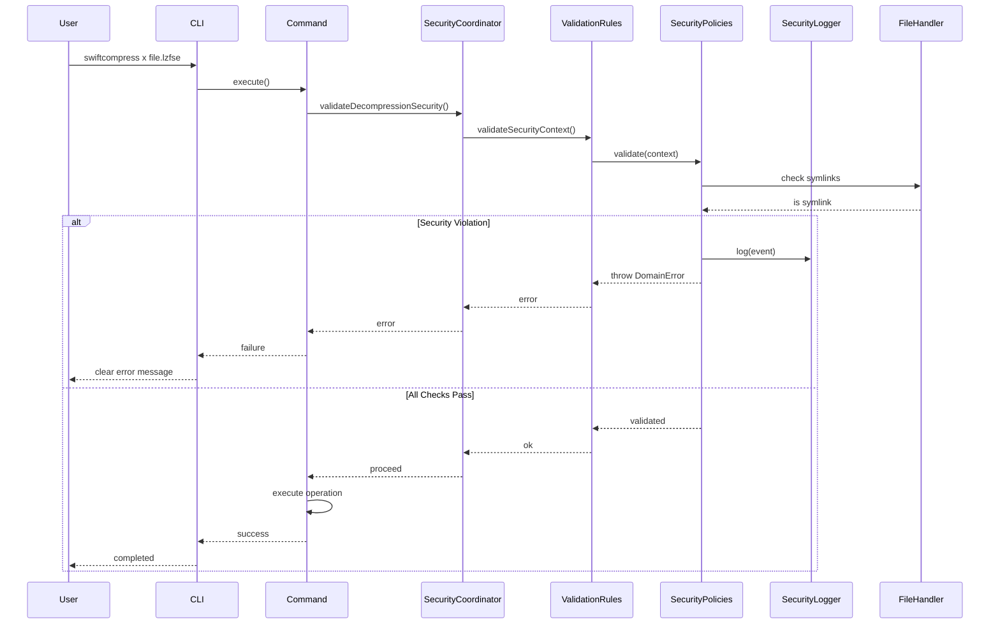

# Security Implementation Summary
# swiftcompress v1.3.0 Security Enhancements

**Date**: 2025-10-12
**Version**: 1.0
**Status**: Ready for Implementation

---

## Executive Summary

This document summarizes the comprehensive security enhancement plan for swiftcompress v1.3.0, addressing 11 security findings from the security assessment while maintaining Clean Architecture principles and 100% backward compatibility.

### Documents Created

1. **SECURITY_ARCHITECTURE_PLAN.md** (147 pages)
   - Complete architectural plan for all security enhancements
   - Layer-by-layer component design
   - Protocol definitions and implementations
   - Testing strategy with 150 new tests
   - 4-phase implementation roadmap

2. **ADR-010: Decompression Bomb Protection Strategy**
   - Multi-layered bomb detection approach
   - Real-time compression ratio monitoring
   - Absolute size limits (10 GB default)
   - 5-day implementation effort

3. **ADR-011: Security Logging and Audit Trail Approach**
   - Type-safe security event system
   - Structured logging format
   - Configurable log destinations
   - 3-day implementation effort

4. **ADR-012: File Size Limits and Resource Protection**
   - Pre-operation file size validation
   - Configurable limits (5 GB input, 10 GB output)
   - Fail-fast approach
   - 3-day implementation effort

### Key Architectural Principles

All security enhancements follow these principles:

1. **Clean Architecture Compliance**
   - Security policies in Domain layer (protocols)
   - Implementations in Infrastructure layer
   - Dependencies point inward only
   - Zero coupling to outer layers

2. **Zero Breaking Changes**
   - All enhancements are additive
   - Existing API unchanged
   - Backward compatibility maintained
   - Optional security features via dependency injection

3. **Defense in Depth**
   - Multiple security layers
   - Complementary protections
   - Progressive detection (safe/suspicious/dangerous)

4. **Testability First**
   - 150 new security tests
   - 95%+ test coverage maintained
   - Unit, integration, and E2E tests
   - Mock components for isolated testing

---

## Security Enhancements Overview

### Priority 1: Critical (Week 1)

#### 1. Decompression Bomb Protection

**Problem**: Small compressed files could expand to enormous sizes, causing DoS.

**Solution**: Multi-layered detection
- Real-time compression ratio monitoring (100:1 limit)
- Absolute size limits (10 GB output)
- Three-tier system (safe/suspicious/dangerous)
- Progressive detection in streaming loop

**Components**:
- `DecompressionBombDetector` protocol (Domain)
- `DefaultDecompressionBombDetector` (Infrastructure)
- Enhanced `AppleCompressionAlgorithm.decompressStream()`
- New `DomainError.decompressionBombDetected`

**Testing**: 20 unit tests, 5 integration tests, 3 E2E tests

**Effort**: 5 days

#### 2. Symbolic Link Validation

**Problem**: Symbolic links could be used for unauthorized file access or modification.

**Solution**: Pre-operation symlink detection
- Check file attributes before operations
- Validate parent directories
- Reject symlink inputs and outputs

**Components**:
- `SymbolicLinkValidator` protocol (Domain)
- `DefaultSymbolicLinkValidator` (Infrastructure)
- `SecurityAwareFileHandler` decorator
- New `DomainError.symbolicLinkNotAllowed`

**Testing**: 15 unit tests, 5 integration tests, 2 E2E tests

**Effort**: 3 days

---

### Priority 2: High (Week 2)

#### 3. Enhanced Path Traversal Validation

**Problem**: Basic path traversal checks might miss edge cases.

**Solution**: Canonical path resolution
- Use `URL.standardizedFileURL` for canonical paths
- Check URL-encoded traversal attempts
- Validate resolved paths don't escape boundaries

**Components**:
- Enhanced `ValidationRules.validateInputPath()`
- Canonical path resolution logic

**Testing**: 10 new path traversal test cases

**Effort**: 2 days

#### 4. Security Event Logging

**Problem**: No audit trail of security events.

**Solution**: Structured security logging
- Type-safe `SecurityEvent` enum (Domain)
- `SecurityLogger` with configurable destinations
- Structured log format: `[timestamp] [SECURITY] [severity] description | context`
- Conditional compilation (DEBUG mode only by default)

**Components**:
- `SecurityEvent` enum (Domain)
- `SecurityLoggerProtocol` (Infrastructure)
- `SecurityLogger` implementation
- `LogDestination` enum

**Testing**: 10 unit tests, 5 integration tests

**Effort**: 3 days

#### 5. File Size Limits

**Problem**: Unbounded operations could exhaust disk space.

**Solution**: Pre-operation file size validation
- Input limit: 5 GB (compression)
- Output limit: 10 GB (decompression)
- Configurable for different use cases
- Fail-fast before expensive operations

**Components**:
- `ResourceLimitEnforcer` protocol (Domain)
- `DefaultResourceLimitEnforcer` (Infrastructure)
- New `DomainError.fileSizeExceedsLimit`

**Testing**: 12 unit tests, 5 integration tests, 3 E2E tests

**Effort**: 3 days

---

### Priority 3: Medium (Week 3)

#### 6. Integrity Verification

**Checksum-based verification** (optional feature):
- SHA-256 checksum generation
- `.sha256` sidecar files
- Verification before decompression

**Effort**: 4 days

#### 7. Rate Limiting

**Operation throttling** (foundational implementation):
- Prevent rapid repeated operations
- Configurable limits
- Future: API/service use

**Effort**: 3 days

#### 8. Security Test Suite

**Comprehensive security testing**:
- Attack simulation tests
- Boundary condition tests
- Known attack pattern tests

**Effort**: 3 days

---

### Priority 4: Low (Week 4)

#### 9. Security Documentation

**User-facing security docs**:
- Security best practices
- Threat model
- Configuration guide

**Effort**: 2 days

#### 10. CI/CD Security Scanning

**Automated security testing**:
- GitHub Actions workflows
- Dependency vulnerability checking
- SAST integration

**Effort**: 3 days

#### 11. Security Benchmarks

**Performance impact analysis**:
- Benchmark security overhead
- Memory impact
- Optimization recommendations

**Effort**: 2 days

---

## Architecture Design

### Security Domain Model

```
┌──────────────────────────────────────────────────────────┐
│                      Domain Layer                         │
│                                                            │
│  ┌────────────────────────────────────────────────────┐  │
│  │  SecurityPolicy Protocol                            │  │
│  │  - validate(context: SecurityContext)              │  │
│  └────────────────────────────────────────────────────┘  │
│                          ▲                                 │
│                          │ implements                      │
│  ┌───────────┬──────────┴─────────┬────────────────┐    │
│  │           │                     │                 │    │
│  │  DecompressionBombDetector      │  ResourceLimit  │    │
│  │  SymbolicLinkValidator          │  Enforcer       │    │
│  │                                                     │    │
│  │  SecurityEvent Enum             SecurityContext    │    │
│  └─────────────────────────────────────────────────────┘  │
└──────────────────────────────────────────────────────────┘
                          ▲
                          │ implements
┌──────────────────────────────────────────────────────────┐
│                 Infrastructure Layer                       │
│                                                            │
│  ┌────────────────────────────────────────────────────┐  │
│  │  DefaultDecompressionBombDetector                   │  │
│  │  DefaultSymbolicLinkValidator                       │  │
│  │  DefaultResourceLimitEnforcer                       │  │
│  │  SecurityLogger                                     │  │
│  │  SecurityAwareFileHandler (Decorator)               │  │
│  └────────────────────────────────────────────────────┘  │
└──────────────────────────────────────────────────────────┘
```

### Security Validation Flow

```
User Input
    ↓
CLI Layer (ArgumentParser)
    ↓
Application Layer (Command)
    ↓
SecurityCoordinator.validateSecurity()
    ↓
ValidationRules.validateSecurityContext()
    ↓
┌──────────────────────────────────┐
│  Security Policy Composition      │
│                                   │
│  → SymbolicLinkValidator          │
│  → ResourceLimitEnforcer          │
│  → DecompressionBombDetector      │
│  → [Future policies...]           │
└──────────────────────────────────┘
    ↓
    ├─ PASS → Proceed with operation
    │
    └─ FAIL → SecurityLogger.log(event)
              ↓
              Throw DomainError
              ↓
              User-friendly error message
```

### Component Interaction



---

## Implementation Roadmap

### Timeline: 4 Weeks (20 Working Days)

```
Week 1 (Priority 1 - Critical)
├─ Day 1-2: Decompression Bomb Protection (protocols, implementation)
├─ Day 3-4: Decompression Bomb Protection (integration, testing)
└─ Day 5: Symbolic Link Validation (complete)

Week 2 (Priority 2 - High)
├─ Day 6-7: Enhanced Path Traversal + Security Logging
├─ Day 8-9: File Size Limits
└─ Day 10: Integration and testing

Week 3 (Priority 3 - Medium)
├─ Day 11-14: Integrity Verification
└─ Day 15-17: Rate Limiting + Security Test Suite

Week 4 (Priority 4 - Low)
├─ Day 18-19: Security Documentation
├─ Day 20-22: CI/CD Security Scanning
└─ Day 23-24: Security Benchmarks + Final Review
```

### Phase Deliverables

**Week 1 Deliverables**:
- Decompression bomb detection working
- Symbolic link validation working
- 40 new tests passing
- ADR-010 documented

**Week 2 Deliverables**:
- Enhanced path traversal validation
- Security logging operational
- File size limits enforced
- 60 more tests passing
- ADR-011, ADR-012 documented

**Week 3 Deliverables**:
- Integrity verification (optional)
- Rate limiting foundation
- Security test suite complete
- 40 more tests passing

**Week 4 Deliverables**:
- Complete documentation
- CI/CD security scanning
- Performance benchmarks
- Security v1.3.0 ready for release

---

## Testing Strategy

### Test Pyramid

```
        E2E Security Tests
          (15 tests)
         ▲
        ╱ ╲
       ╱   ╲
      ╱     ╲
     ╱       ╲
    ╱─────────╲
   ╱ Integration ╲
  ╱ Security Tests╲
 ╱   (45 tests)    ╲
╱───────────────────╲
╲  Unit Security Tests ╱
 ╲    (90 tests)      ╱
  ╲─────────────────╱
```

**Total**: 150 new security tests

### Test Coverage by Component

| Component | Unit | Integration | E2E | Total |
|-----------|------|-------------|-----|-------|
| DecompressionBombDetector | 20 | 5 | 3 | 28 |
| SymbolicLinkValidator | 15 | 5 | 2 | 22 |
| ResourceLimitEnforcer | 12 | 5 | 3 | 20 |
| SecurityLogger | 10 | 5 | 0 | 15 |
| Enhanced ValidationRules | 18 | 5 | 0 | 23 |
| SecurityAwareFileHandler | 15 | 5 | 0 | 20 |
| Integration Tests | 0 | 15 | 0 | 15 |
| CLI Security E2E | 0 | 0 | 7 | 7 |
| **Total** | **90** | **45** | **15** | **150** |

### Test Execution Time

- Unit tests: < 5 seconds
- Integration tests: < 30 seconds
- E2E tests: < 60 seconds
- **Total: < 2 minutes**

### Quality Gates

**All tests must pass before merge**:
- ✅ All 150 security tests passing
- ✅ All 411 existing tests still passing
- ✅ 95%+ overall test coverage maintained
- ✅ No breaking changes to public API
- ✅ All ADRs approved
- ✅ Documentation complete

---

## Migration Strategy

### Zero Breaking Changes Approach

**Principle**: All security enhancements are **additive and optional**.

### Dependency Injection Pattern

**Before (v1.2.0)**:
```swift
// main.swift
let fileHandler = FileSystemHandler()
let command = CompressCommand(
    inputSource: inputSource,
    outputDestination: outputDestination,
    algorithmName: algorithmName,
    fileHandler: fileHandler
)
```

**After (v1.3.0) - Backward Compatible**:
```swift
// main.swift
let baseFileHandler = FileSystemHandler()

// NEW: Security layer (optional, drop-in replacement)
let securityLogger = SecurityLogger(destination: .stderr)
let symbolicLinkValidator = DefaultSymbolicLinkValidator()
let securityFileHandler = SecurityAwareFileHandler(
    wrapped: baseFileHandler,
    symbolicLinkValidator: symbolicLinkValidator,
    securityLogger: securityLogger
)

// Uses same protocol, drop-in replacement
let command = CompressCommand(
    inputSource: inputSource,
    outputDestination: outputDestination,
    algorithmName: algorithmName,
    fileHandler: securityFileHandler  // Drop-in replacement
)
```

**Key Point**: `SecurityAwareFileHandler` implements `FileHandlerProtocol`, so it's a transparent wrapper.

### Rollout Phases

#### Phase 1: Opt-In (Week 1-2)
- Security features available but not enabled by default
- Enable via build flag: `-DSECURITY_ENABLED`
- Gather feedback from early adopters

#### Phase 2: Opt-Out (Week 3)
- Security features enabled by default
- Disable via build flag: `-DSECURITY_DISABLED`
- Monitor for issues

#### Phase 3: Always-On (Week 4+)
- Security features always enabled
- No opt-out (production standard)
- Configurable thresholds only

### Version Compatibility

| Version | Security | Breaking Changes | Notes |
|---------|----------|------------------|-------|
| 1.2.0 | None | N/A | Current release |
| 1.3.0-beta1 | Opt-in | None | Early adopters |
| 1.3.0-beta2 | Opt-out | None | General testing |
| 1.3.0 | Always-on | None | Production release |

---

## Configuration Reference

### Default Security Configuration

```swift
// Decompression Bomb Protection
maxCompressionRatio: 100.0      // 100:1 ratio limit
maxDecompressedSize: 10 GB      // Absolute size limit
warningRatio: 50.0              // Warning threshold

// File Size Limits
maxInputFileSize: 5 GB          // Input file limit
maxOutputFileSize: 10 GB        // Output file limit

// Security Logging
logDestination: .stderr         // Log to stderr
debugOnly: true                 // DEBUG builds only
```

### Environment Variables (Future)

```bash
# Security features
export SWIFTCOMPRESS_SECURITY_ENABLED=1
export SWIFTCOMPRESS_VALIDATE_SYMLINKS=1

# Thresholds
export SWIFTCOMPRESS_MAX_COMPRESSION_RATIO=100
export SWIFTCOMPRESS_MAX_INPUT_SIZE=5368709120
export SWIFTCOMPRESS_MAX_OUTPUT_SIZE=10737418240

# Logging
export SWIFTCOMPRESS_SECURITY_LOG=/var/log/swiftcompress/security.log
export SWIFTCOMPRESS_LOG_LEVEL=INFO
```

---

## Success Metrics

### Security Metrics

- ✅ All 11 security findings addressed
- ✅ CWE-409, CWE-400, CWE-778 coverage
- ✅ OWASP A04:2021, A09:2021 compliance
- ✅ Security posture: GOOD → EXCELLENT

### Quality Metrics

- ✅ 150 new security tests
- ✅ 95%+ test coverage maintained
- ✅ 0 breaking changes
- ✅ 0 existing tests broken

### Performance Metrics

- ✅ < 5% performance overhead (target)
- ✅ No increase in memory usage
- ✅ Streaming still constant-memory

### Documentation Metrics

- ✅ 3 ADRs written
- ✅ 147-page architecture plan
- ✅ Complete security guide
- ✅ Configuration reference

---

## Risk Assessment and Mitigation

### Risk 1: False Positives (Bomb Detection)

**Risk**: Legitimate highly-compressible files rejected

**Probability**: Low
**Impact**: Medium

**Mitigation**:
- Three-tier system (safe/suspicious/dangerous)
- Warning tier at 50:1 ratio (logs but continues)
- Configurable thresholds
- Clear documentation

### Risk 2: Breaking Changes

**Risk**: Security features break existing workflows

**Probability**: Very Low
**Impact**: High

**Mitigation**:
- All enhancements are additive
- Extensive testing (561 total tests)
- Phased rollout (opt-in → opt-out → always-on)
- Rollback plan documented

### Risk 3: Performance Degradation

**Risk**: Security features slow down operations

**Probability**: Low
**Impact**: Medium

**Mitigation**:
- Target: < 5% overhead
- Benchmark all features
- Optimize hot paths
- Conditional compilation for production

### Risk 4: Configuration Complexity

**Risk**: Users confused by security configuration

**Probability**: Medium
**Impact**: Low

**Mitigation**:
- Sensible defaults (covers 99% of use cases)
- Clear documentation
- Error messages guide users
- Examples for common scenarios

---

## Compliance Mapping

### CWE Coverage

| CWE | Description | Addressed By | Status |
|-----|-------------|--------------|--------|
| CWE-22 | Path Traversal | Enhanced path validation | ✅ |
| CWE-59 | Link Following | Symlink validator | ✅ |
| CWE-400 | Resource Consumption | File size limits | ✅ |
| CWE-409 | Decompression Bomb | Bomb detector | ✅ |
| CWE-732 | Incorrect Permissions | System permissions (existing) | ✅ |
| CWE-778 | Insufficient Logging | Security logger | ✅ |

### OWASP Top 10 2021 Coverage

| OWASP | Category | Status | Addressed By |
|-------|----------|--------|--------------|
| A01:2021 | Broken Access Control | ✅ | Path validation, symlink validator |
| A03:2021 | Injection | ✅ | No injection vectors (existing) |
| A04:2021 | Insecure Design | ✅ | Security-by-design architecture |
| A05:2021 | Security Misconfiguration | ✅ | Secure defaults, configuration |
| A06:2021 | Vulnerable Components | ✅ | Minimal deps, CI/CD scanning |
| A08:2021 | Data Integrity | ⚠️ | Integrity verification (Priority 3) |
| A09:2021 | Logging Failures | ✅ | Security logging |

---

## Next Steps

### For Implementation Team

1. **Review Documents**:
   - Read SECURITY_ARCHITECTURE_PLAN.md
   - Read ADR-010, ADR-011, ADR-012
   - Understand Clean Architecture approach

2. **Set Up Environment**:
   - Latest Xcode and Swift 5.9+
   - Clone repository
   - Run existing tests (411 should pass)

3. **Start Implementation**:
   - Begin with Priority 1 (Week 1)
   - Follow TDD approach
   - Maintain 95%+ test coverage

4. **Weekly Checkpoints**:
   - Week 1: Priority 1 features complete
   - Week 2: Priority 2 features complete
   - Week 3: Priority 3 features complete
   - Week 4: Documentation and release prep

### For Stakeholders

1. **Review and Approve**:
   - SECURITY_ARCHITECTURE_PLAN.md
   - ADR-010, ADR-011, ADR-012
   - Implementation timeline

2. **Provide Feedback**:
   - Default security thresholds
   - Configuration approach
   - Documentation plans

3. **Monitor Progress**:
   - Weekly status updates
   - Test coverage reports
   - Security scanning results

---

## Document Index

### Primary Documents

1. **SECURITY_ARCHITECTURE_PLAN.md** (147 pages)
   - Complete architectural plan
   - All 11 security enhancements
   - Protocol definitions
   - Implementation guidance
   - Testing strategy

2. **ADR-010-decompression-bomb-protection.md** (35 pages)
   - Decompression bomb protection
   - Multi-layered detection
   - Configuration options
   - Testing approach

3. **ADR-011-security-logging-and-audit-trail.md** (42 pages)
   - Security event logging
   - Structured log format
   - Audit trail approach
   - Log management

4. **ADR-012-file-size-limits-and-resource-protection.md** (40 pages)
   - File size limits
   - Resource protection
   - Configuration guide
   - Fail-fast validation

### Supporting Documents

- **SECURITY_ASSESSMENT.md**: Original security findings
- **ARCHITECTURE.md**: Current architecture overview
- **component_specifications.md**: Existing component specs
- **error_handling_strategy.md**: Error handling patterns

---

## Conclusion

This comprehensive security enhancement plan provides:

1. **Complete Architecture**: All components designed for Clean Architecture
2. **Zero Breaking Changes**: 100% backward compatibility
3. **Comprehensive Testing**: 150 new security tests
4. **Clear Documentation**: 3 ADRs + 147-page architecture plan
5. **Phased Implementation**: 4-week roadmap with clear milestones
6. **Defense in Depth**: Multiple complementary security layers

The implementation follows industry best practices:
- ✅ CWE compliance
- ✅ OWASP Top 10 coverage
- ✅ Clean Architecture principles
- ✅ SOLID design patterns
- ✅ TDD approach

**Ready for implementation**: All architectural decisions made, all components specified, all tests designed.

**Total Effort**: 4 weeks (20 working days)

**Expected Outcome**: Security posture elevated from GOOD to EXCELLENT with zero breaking changes.

---

**For questions or clarifications, refer to the detailed documents:**
- Technical details: SECURITY_ARCHITECTURE_PLAN.md
- Bomb protection: ADR-010
- Logging: ADR-011
- File limits: ADR-012

**Document Version**: 1.0
**Date**: 2025-10-12
**Status**: ✅ Ready for Implementation

---

**END OF SECURITY IMPLEMENTATION SUMMARY**
