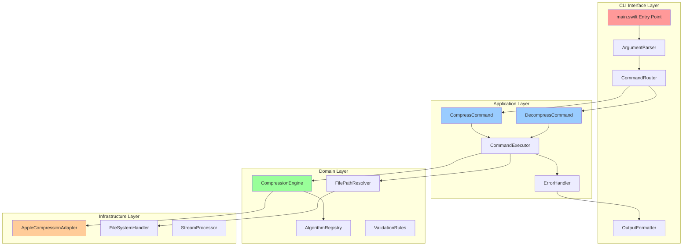
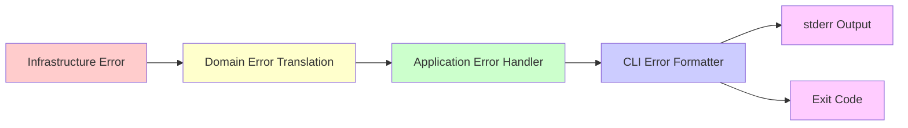

# SwiftCompress Architecture Overview

**Project**: swiftcompress
**Type**: macOS CLI Tool
**Language**: Swift 5.9+
**Primary Framework**: Apple Compression Framework
**Architecture Pattern**: Clean Architecture (4 layers)

## Executive Summary

SwiftCompress is a command-line tool for compressing and decompressing files using Apple's native Compression framework. The architecture follows **Clean Architecture principles** adapted for CLI applications, emphasizing clear separation of concerns, testability, and maintainability.

**Status**: ✅ Production Ready (v1.2.0) - All 4 phases complete, 411 tests passing, 95%+ coverage

This document provides a high-level architectural overview. For detailed component specifications, see [component_specifications.md](./component_specifications.md).

## Architectural Principles

### 1. Clean Architecture for CLI Applications

The system is organized into distinct layers with unidirectional dependency flow:

```
┌─────────────────────────────────────────────────────┐
│           CLI Interface Layer (main.swift)           │
│  - Argument parsing                                  │
│  - Command routing                                   │
│  - Output formatting                                 │
└───────────────┬─────────────────────────────────────┘
                │
                ▼
┌─────────────────────────────────────────────────────┐
│              Application Layer                       │
│  - Command handlers (compress, decompress)           │
│  - Business logic orchestration                      │
│  - Error handling and translation                    │
└───────────────┬─────────────────────────────────────┘
                │
                ▼
┌─────────────────────────────────────────────────────┐
│               Domain Layer                           │
│  - Compression algorithms abstraction                │
│  - File operation abstractions                       │
│  - Business rules and validation                     │
└───────────────┬─────────────────────────────────────┘
                │
                ▼
┌─────────────────────────────────────────────────────┐
│            Infrastructure Layer                      │
│  - Apple Compression Framework integration           │
│  - FileManager operations                            │
│  - System I/O                                        │
└─────────────────────────────────────────────────────┘
```

**Dependency Rule**: Dependencies point inward. Inner layers know nothing about outer layers.

### 2. SOLID Principles Application

**Single Responsibility Principle (SRP)**:
- Each component has one clear purpose
- CLI parsing separated from business logic
- Compression logic separated from file I/O

**Open/Closed Principle (OCP)**:
- Algorithm selection through protocol abstraction
- New compression algorithms can be added without modifying existing code
- Command pattern allows new commands without changing router

**Liskov Substitution Principle (LSP)**:
- All compression algorithm implementations are interchangeable
- File handlers can be substituted for testing

**Interface Segregation Principle (ISP)**:
- Small, focused protocols (CompressionAlgorithm, FileHandler, OutputWriter)
- Clients depend only on interfaces they use

**Dependency Inversion Principle (DIP)**:
- High-level application logic depends on abstractions
- Infrastructure implementations injected at runtime

## High-Level Component Architecture



## Layer Responsibilities

### CLI Interface Layer
**Purpose**: Handle user interaction through command-line interface

**Key Responsibilities**:
- Parse command-line arguments (Swift ArgumentParser)
- Route commands to appropriate handlers
- Format output for stdout/stderr
- Set process exit codes

**Dependencies**: Application Layer (command handlers)

---

### Application Layer
**Purpose**: Orchestrate business operations and workflows

**Key Responsibilities**:
- Execute compression/decompression workflows
- Coordinate between domain services
- Handle application-level errors
- Manage file overwrite logic
- Apply default filename generation

**Dependencies**: Domain Layer (protocols/interfaces)

---

### Domain Layer
**Purpose**: Core business logic and rules (zero outward dependencies)

**Key Responsibilities**:
- Define compression algorithm abstractions
- Algorithm selection and validation
- File path resolution rules
- Input validation and business rules
- Maintain algorithm registry

**Dependencies**: None (pure business logic)

---

### Infrastructure Layer
**Purpose**: System integration and concrete implementations

**Key Responsibilities**:
- Integrate with Apple Compression Framework
- File system operations (FileManager)
- Binary data streaming (64 KB buffers)
- System-level I/O

**Dependencies**: System frameworks (Foundation, Compression)

---

**For detailed component specifications, interfaces, and implementation guidelines, see [component_specifications.md](./component_specifications.md).**

## Data Flow Architecture

### Compression Flow

```
User Input → ArgumentParser → CommandRouter → CompressCommand
                                                      ↓
                                              CommandExecutor
                                                      ↓
FilePathResolver ← ─────────────────────── CompressionEngine
        ↓                                             ↓
FileSystemHandler                           AlgorithmRegistry
        ↓                                             ↓
Read File → StreamProcessor ← ────────── AppleCompressionAdapter
                    ↓
            Compressed Data
                    ↓
        FileSystemHandler (Write)
                    ↓
            OutputFormatter → User
```

### Decompression Flow

```
User Input → ArgumentParser → CommandRouter → DecompressCommand
                                                      ↓
                                              CommandExecutor
                                                      ↓
FilePathResolver ← ─────────────────────── CompressionEngine
        ↓                                             ↓
FileSystemHandler                           AlgorithmRegistry
        ↓                                             ↓
Read File → StreamProcessor ← ────────── AppleCompressionAdapter
                    ↓
           Decompressed Data
                    ↓
        FileSystemHandler (Write)
                    ↓
            OutputFormatter → User
```

## Error Handling Architecture

### Error Flow Strategy



**Error Categories**:
1. **User Input Errors**: Invalid arguments, missing files, invalid algorithm
2. **File System Errors**: Permission denied, disk full, path not found
3. **Compression Errors**: Corrupt data, unsupported format, compression failure
4. **System Errors**: Out of memory, unexpected system failures

**Error Translation**:
- Infrastructure throws specific error types
- Domain layer translates to business error types
- Application layer converts to user-friendly messages
- CLI layer formats for stderr and sets exit codes

## Testing Architecture

### Testing Pyramid Strategy

```
                    /\
                   /  \
                  /    \
                 / E2E  \           10% - Full CLI integration
                /________\
               /          \
              /            \
             / Integration  \      30% - Component integration
            /________________\
           /                  \
          /                    \
         /     Unit Tests       \   60% - Individual components
        /________________________\
```

**Unit Testing** (60%):
- All domain layer components (pure logic)
- Application layer orchestration
- Infrastructure adapters with mocked dependencies

**Integration Testing** (30%):
- File system operations with temp directories
- Compression engine with real Apple framework
- Command execution with mocked I/O

**End-to-End Testing** (10%):
- Full CLI invocations with real files
- Scriptability validation
- Error scenario coverage

## Module Structure Overview

```
swiftcompress/
├── Sources/swiftcompress/
│   ├── CLI/                    # CLI Interface Layer
│   ├── Application/            # Application Layer
│   ├── Domain/                 # Domain Layer (zero outward deps)
│   └── Infrastructure/         # Infrastructure Layer
│
└── Tests/swiftcompressTests/
    ├── UnitTests/             # 60% - Individual components
    ├── IntegrationTests/      # 30% - Multi-component
    └── E2ETests/              # 10% - Full CLI
```

**For complete file structure and organization, see [module_structure.md](./module_structure.md).**

## Key Architectural Decisions

All architectural decisions are documented in detail in the ADRs/ directory. Key decisions include:

| ADR | Decision | Status |
|-----|----------|--------|
| [ADR-001](./ADRs/ADR-001-clean-architecture.md) | Clean Architecture with 4 layers | ✅ Implemented |
| [ADR-002](./ADRs/ADR-002-protocol-abstraction.md) | Protocol-based algorithm abstraction | ✅ Implemented |
| [ADR-003](./ADRs/ADR-003-stream-processing.md) | Stream-based processing (64 KB buffers) | ✅ Implemented |
| [ADR-004](./ADRs/ADR-004-dependency-injection.md) | Constructor-based dependency injection | ✅ Implemented |
| [ADR-005](./ADRs/ADR-005-explicit-algorithm-selection.md) | Explicit algorithm selection with `-m` flag | ✅ Implemented |
| [ADR-006](./ADRs/ADR-006-compression-stream-api.md) | True streaming with compression_stream API | ✅ Implemented |
| [ADR-007](./ADRs/ADR-007-stdin-stdout-streaming.md) | Unix pipeline support (stdin/stdout) | ✅ Implemented |
| [ADR-008](./ADRs/ADR-008-compression-level-support.md) | Compression levels (--fast, --best) | ✅ Implemented |
| [ADR-009](./ADRs/ADR-009-progress-indicator-support.md) | Progress indicators (--progress) | ✅ Implemented |

**For complete ADR documentation, see the [ADRs/](./ADRs/) directory.**

## Design Patterns Applied

### 1. Command Pattern
- Each CLI command (compress, decompress) is a separate command object
- Enables easy addition of new commands
- Supports undo/redo potential for future features

### 2. Strategy Pattern
- Compression algorithms are interchangeable strategies
- Selected at runtime based on user input
- New algorithms can be added without modifying engine

### 3. Adapter Pattern
- AppleCompressionAdapter wraps Apple's Compression Framework
- Isolates infrastructure dependency
- Enables potential future support for other compression libraries

### 4. Registry Pattern
- AlgorithmRegistry maintains available algorithms
- Supports runtime algorithm lookup
- Centralizes algorithm management

### 5. Template Method Pattern
- CommandExecutor defines compression/decompression workflow
- Specific steps implemented by concrete algorithms
- Ensures consistent error handling and validation

## Performance Characteristics

**Memory Management:**
- Stream-based processing with 64 KB buffers
- Constant memory footprint regardless of file size
- Validated: ~9.6 MB peak memory for 100+ MB files

**Scalability:**
- Single-file operations (production)
- Architecture supports future batch processing
- Handles files of arbitrary size

**Validated Performance:**
- 100 MB file compression: 0.67s (LZFSE)
- 100 MB file decompression: 0.25s (LZFSE)
- Memory usage: < 10 MB peak (independent of file size)

## Security Architecture

**Input Validation:**
- Path traversal prevention
- Algorithm name whitelist validation
- Safe file overwrite protection

**File System Security:**
- Respect system file permissions
- Explicit `-f` flag required for overwrite
- Validate output paths before writing

**Error Handling:**
- No sensitive path disclosure in error messages
- No stack traces in user-facing output
- Generic error codes for security failures

## Implementation Phases

| Phase | Features | Status |
|-------|----------|--------|
| **Phase 0** | Architecture planning | ✅ Complete |
| **Phase 1** | MVP (4 algorithms, basic CLI) | ✅ Complete |
| **Phase 2** | Usability (auto-detection, help) | ✅ Complete |
| **Phase 3** | Unix pipelines (stdin/stdout) | ✅ Complete |
| **Phase 4** | Advanced (levels, progress) | ✅ Complete |

**For detailed roadmap and milestones, see [ROADMAP.md](../ROADMAP.md).**

## Technology Stack

| Component | Technology | Rationale |
|-----------|-----------|-----------|
| **Language** | Swift 5.9+ | Native macOS, type safety, performance |
| **Compression** | Apple Compression Framework | Native, optimized, zero external deps |
| **CLI Parsing** | Swift ArgumentParser | Official Apple library, type-safe |
| **Testing** | XCTest | Native Swift testing, 95%+ coverage |
| **Build** | Swift Package Manager | Native, integrated, modern |

## Quality Attributes

| Attribute | Implementation | Status |
|-----------|----------------|--------|
| **Testability** | Protocol-based design, pure domain layer, 95%+ coverage | ✅ Achieved |
| **Maintainability** | Clear layer separation, SOLID principles, comprehensive docs | ✅ Achieved |
| **Reliability** | Comprehensive error handling, input validation, atomic operations | ✅ Achieved |
| **Performance** | Stream processing, constant memory, native Apple framework | ✅ Validated |
| **Usability** | Clear error messages, standard CLI conventions, helpful defaults | ✅ Achieved |
| **Extensibility** | Protocol abstractions, registry pattern, dependency injection | ✅ Achieved |

## Related Documentation

This overview provides high-level architectural understanding. For detailed information:

1. **[component_specifications.md](./component_specifications.md)** - Detailed component contracts and implementation guidelines
2. **[module_structure.md](./module_structure.md)** - File organization and project structure
3. **[data_flow_diagrams.md](./data_flow_diagrams.md)** - Visual data flow representations
4. **[error_handling_strategy.md](./error_handling_strategy.md)** - Comprehensive error handling approach
5. **[testing_strategy.md](./testing_strategy.md)** - Testing requirements and patterns
6. **[ADRs/](./ADRs/)** - Architecture decision records with full context

For development setup and workflow, see [SETUP.md](../SETUP.md) and [ROADMAP.md](../ROADMAP.md).

---

**This architecture provides a production-ready foundation for a maintainable, testable, and extensible CLI compression tool following Clean Architecture and Swift best practices.**
