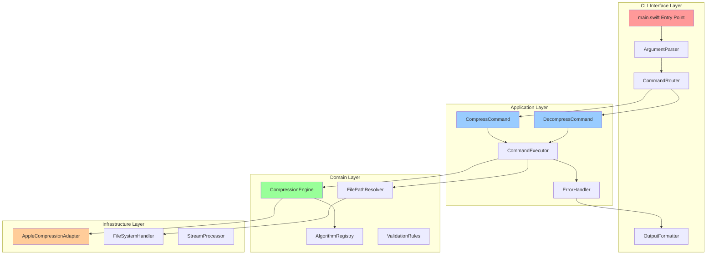
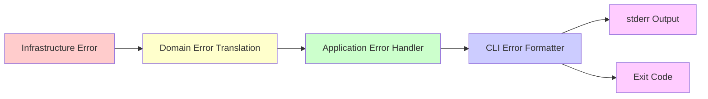

# SwiftCompress Architecture Overview

**Project**: swiftcompress
**Type**: macOS CLI Tool
**Language**: Swift
**Primary Framework**: Apple Compression Framework
**Dependency Management**: Swift Package Manager

## Executive Summary

SwiftCompress is a command-line tool for compressing and decompressing files using Apple's native Compression framework. The architecture follows Clean Architecture principles adapted for CLI applications, emphasizing clear separation of concerns, testability, and maintainability.

## Architectural Principles

### 1. Clean Architecture for CLI Applications

The system is organized into distinct layers with unidirectional dependency flow:

```
┌─────────────────────────────────────────────────────┐
│           CLI Interface Layer (main.swift)           │
│  - Argument parsing                                  │
│  - Command routing                                   │
│  - Output formatting                                 │
└───────────────┬─────────────────────────────────────┘
                │
                ▼
┌─────────────────────────────────────────────────────┐
│              Application Layer                       │
│  - Command handlers (compress, decompress)           │
│  - Business logic orchestration                      │
│  - Error handling and translation                    │
└───────────────┬─────────────────────────────────────┘
                │
                ▼
┌─────────────────────────────────────────────────────┐
│               Domain Layer                           │
│  - Compression algorithms abstraction                │
│  - File operation abstractions                       │
│  - Business rules and validation                     │
└───────────────┬─────────────────────────────────────┘
                │
                ▼
┌─────────────────────────────────────────────────────┐
│            Infrastructure Layer                      │
│  - Apple Compression Framework integration           │
│  - FileManager operations                            │
│  - System I/O                                        │
└─────────────────────────────────────────────────────┘
```

**Dependency Rule**: Dependencies point inward. Inner layers know nothing about outer layers.

### 2. SOLID Principles Application

**Single Responsibility Principle (SRP)**:
- Each component has one clear purpose
- CLI parsing separated from business logic
- Compression logic separated from file I/O

**Open/Closed Principle (OCP)**:
- Algorithm selection through protocol abstraction
- New compression algorithms can be added without modifying existing code
- Command pattern allows new commands without changing router

**Liskov Substitution Principle (LSP)**:
- All compression algorithm implementations are interchangeable
- File handlers can be substituted for testing

**Interface Segregation Principle (ISP)**:
- Small, focused protocols (CompressionAlgorithm, FileHandler, OutputWriter)
- Clients depend only on interfaces they use

**Dependency Inversion Principle (DIP)**:
- High-level application logic depends on abstractions
- Infrastructure implementations injected at runtime

## High-Level Component Architecture



## Layer Responsibilities

### CLI Interface Layer

**Purpose**: Handle all user interaction through command-line interface

**Responsibilities**:
- Parse command-line arguments using Swift ArgumentParser
- Route commands to appropriate handlers
- Format output for stdout/stderr
- Set process exit codes
- Handle --help and --version flags

**Key Components**:
- `main.swift`: Application entry point
- `ArgumentParser`: Wraps third-party CLI parsing library
- `CommandRouter`: Maps parsed arguments to command handlers
- `OutputFormatter`: Formats success/error messages for terminal

**Dependencies**: Application Layer command interfaces

### Application Layer

**Purpose**: Orchestrate business operations and handle application workflows

**Responsibilities**:
- Execute compression/decompression workflows
- Coordinate between domain services
- Handle business-level error scenarios
- Manage file overwrite logic
- Apply default filename generation rules

**Key Components**:
- `CompressCommand`: Orchestrates file compression workflow
- `DecompressCommand`: Orchestrates file decompression workflow
- `CommandExecutor`: Coordinates command execution
- `ErrorHandler`: Translates domain errors to user-friendly messages

**Dependencies**: Domain Layer abstractions (protocols/interfaces)

### Domain Layer

**Purpose**: Contain core business logic and rules

**Responsibilities**:
- Define compression algorithm abstractions
- Implement algorithm selection and validation
- Define file path resolution rules
- Validate inputs against business rules
- Maintain algorithm registry

**Key Components**:
- `CompressionEngine`: Core compression/decompression orchestration
- `AlgorithmRegistry`: Registry of available compression algorithms
- `FilePathResolver`: Resolves input/output file paths with defaults
- `ValidationRules`: Business validation logic

**Dependencies**: None (pure business logic with protocol definitions)

### Infrastructure Layer

**Purpose**: Provide concrete implementations for external systems

**Responsibilities**:
- Integrate with Apple Compression Framework
- Perform actual file system operations
- Handle binary data streaming
- Manage system-level I/O

**Key Components**:
- `AppleCompressionAdapter`: Wraps Apple Compression Framework
- `FileSystemHandler`: Implements file operations via FileManager
- `StreamProcessor`: Handles data streaming for large files

**Dependencies**: System frameworks (Foundation, Compression)

## Data Flow Architecture

### Compression Flow

```
User Input → ArgumentParser → CommandRouter → CompressCommand
                                                      ↓
                                              CommandExecutor
                                                      ↓
FilePathResolver ← ─────────────────────── CompressionEngine
        ↓                                             ↓
FileSystemHandler                           AlgorithmRegistry
        ↓                                             ↓
Read File → StreamProcessor ← ────────── AppleCompressionAdapter
                    ↓
            Compressed Data
                    ↓
        FileSystemHandler (Write)
                    ↓
            OutputFormatter → User
```

### Decompression Flow

```
User Input → ArgumentParser → CommandRouter → DecompressCommand
                                                      ↓
                                              CommandExecutor
                                                      ↓
FilePathResolver ← ─────────────────────── CompressionEngine
        ↓                                             ↓
FileSystemHandler                           AlgorithmRegistry
        ↓                                             ↓
Read File → StreamProcessor ← ────────── AppleCompressionAdapter
                    ↓
           Decompressed Data
                    ↓
        FileSystemHandler (Write)
                    ↓
            OutputFormatter → User
```

## Error Handling Architecture

### Error Flow Strategy



**Error Categories**:
1. **User Input Errors**: Invalid arguments, missing files, invalid algorithm
2. **File System Errors**: Permission denied, disk full, path not found
3. **Compression Errors**: Corrupt data, unsupported format, compression failure
4. **System Errors**: Out of memory, unexpected system failures

**Error Translation**:
- Infrastructure throws specific error types
- Domain layer translates to business error types
- Application layer converts to user-friendly messages
- CLI layer formats for stderr and sets exit codes

## Testing Architecture

### Testing Pyramid Strategy

```
                    /\
                   /  \
                  /    \
                 / E2E  \           10% - Full CLI integration
                /________\
               /          \
              /            \
             / Integration  \      30% - Component integration
            /________________\
           /                  \
          /                    \
         /     Unit Tests       \   60% - Individual components
        /________________________\
```

**Unit Testing** (60%):
- All domain layer components (pure logic)
- Application layer orchestration
- Infrastructure adapters with mocked dependencies

**Integration Testing** (30%):
- File system operations with temp directories
- Compression engine with real Apple framework
- Command execution with mocked I/O

**End-to-End Testing** (10%):
- Full CLI invocations with real files
- Scriptability validation
- Error scenario coverage

## Module Structure Overview

```
swiftcompress/
├── Sources/
│   ├── CLI/                    # CLI Interface Layer
│   │   ├── main.swift
│   │   ├── ArgumentParser.swift
│   │   ├── CommandRouter.swift
│   │   └── OutputFormatter.swift
│   │
│   ├── Application/            # Application Layer
│   │   ├── Commands/
│   │   │   ├── CompressCommand.swift
│   │   │   └── DecompressCommand.swift
│   │   ├── CommandExecutor.swift
│   │   └── ErrorHandler.swift
│   │
│   ├── Domain/                 # Domain Layer
│   │   ├── CompressionEngine.swift
│   │   ├── AlgorithmRegistry.swift
│   │   ├── FilePathResolver.swift
│   │   ├── ValidationRules.swift
│   │   └── Protocols/
│   │       ├── CompressionAlgorithm.swift
│   │       ├── FileHandler.swift
│   │       └── OutputWriter.swift
│   │
│   └── Infrastructure/         # Infrastructure Layer
│       ├── AppleCompressionAdapter.swift
│       ├── FileSystemHandler.swift
│       ├── StreamProcessor.swift
│       └── Algorithms/
│           ├── LZFSEAlgorithm.swift
│           ├── LZ4Algorithm.swift
│           ├── ZlibAlgorithm.swift
│           └── LZMAAlgorithm.swift
│
└── Tests/
    ├── UnitTests/
    ├── IntegrationTests/
    └── E2ETests/
```

## Key Architectural Decisions

### ADR-001: Clean Architecture for CLI Tool
**Decision**: Adopt Clean Architecture with layer separation
**Rationale**: Enables testability, maintainability, and clear separation of concerns

### ADR-002: Protocol-Based Algorithm Abstraction
**Decision**: Use Swift protocols for compression algorithm abstraction
**Rationale**: Allows easy addition of new algorithms without modifying existing code

### ADR-003: Stream-Based Processing
**Decision**: Process files as streams rather than loading entirely into memory
**Rationale**: Supports large file compression without memory constraints

### ADR-004: Dependency Injection for Infrastructure
**Decision**: Inject infrastructure dependencies at application startup
**Rationale**: Enables testing with mocked implementations

### ADR-005: Explicit Algorithm Selection Required (MVP)
**Decision**: Require `-m` flag for compression operations in MVP
**Rationale**: Simplifies initial implementation; auto-detection is future enhancement

## Design Patterns Applied

### 1. Command Pattern
- Each CLI command (compress, decompress) is a separate command object
- Enables easy addition of new commands
- Supports undo/redo potential for future features

### 2. Strategy Pattern
- Compression algorithms are interchangeable strategies
- Selected at runtime based on user input
- New algorithms can be added without modifying engine

### 3. Adapter Pattern
- AppleCompressionAdapter wraps Apple's Compression Framework
- Isolates infrastructure dependency
- Enables potential future support for other compression libraries

### 4. Registry Pattern
- AlgorithmRegistry maintains available algorithms
- Supports runtime algorithm lookup
- Centralizes algorithm management

### 5. Template Method Pattern
- CommandExecutor defines compression/decompression workflow
- Specific steps implemented by concrete algorithms
- Ensures consistent error handling and validation

## Performance Considerations

### Memory Management
- Stream-based processing to handle large files
- Chunked reading/writing (configurable buffer size)
- Automatic memory cleanup with Swift ARC

### Scalability
- Designed for single-file operations (MVP scope)
- Architecture supports future batch processing
- Algorithm selection optimized with registry lookup

### Error Recovery
- Graceful degradation on failures
- Atomic file operations where possible
- Cleanup of partial output on errors

## Security Considerations

### Input Validation
- Path traversal prevention in file path resolution
- Algorithm name validation against whitelist
- File size limits for compression operations

### File System Security
- Respect system file permissions
- Prevent overwriting without explicit `-f` flag
- Validate output paths before writing

### Error Information Disclosure
- Error messages don't expose sensitive system paths
- Generic error codes for security-sensitive failures
- No stack traces in user-facing output

## Extensibility Points

### Phase 1 (MVP)
- Basic compress/decompress with four algorithms
- File-based operations only
- Explicit algorithm selection required

### Phase 2 (Usability)
- Algorithm auto-detection from file extensions
- Enhanced help system
- Overwrite protection

### Phase 3 (Advanced)
- stdin/stdout streaming support
- Compression level tuning
- Progress indicators for large files
- Batch file operations

## Dependencies and Integration Points

### External Dependencies
- **Swift ArgumentParser**: CLI argument parsing (Official Apple library)
- **Apple Compression Framework**: Core compression functionality
- **Foundation Framework**: File system operations, data handling

### System Integration
- **macOS FileManager**: File operations
- **Standard Streams**: stdin, stdout, stderr
- **Process Exit Codes**: Script integration

## Quality Attributes

### Testability
- Protocol-based design enables easy mocking
- Pure domain logic with no external dependencies
- Integration test support with temporary file systems

### Maintainability
- Clear layer separation
- Single Responsibility Principle throughout
- Comprehensive documentation

### Reliability
- Comprehensive error handling at all layers
- Input validation before operations
- Atomic file operations where possible

### Usability
- Clear error messages
- Predictable default behavior
- Standard CLI conventions (flags, help, exit codes)

### Performance
- Stream-based processing for memory efficiency
- Native Apple framework for optimal speed
- Minimal overhead from abstraction layers

## Next Steps

Implementation teams should review:
1. **component_specifications.md** - Detailed component responsibilities
2. **module_structure.md** - File organization and naming conventions
3. **data_flow_diagrams.md** - Detailed operation flows
4. **error_handling_strategy.md** - Comprehensive error handling approach
5. **testing_strategy.md** - Testing requirements and approaches
6. **ADRs/** - Individual architecture decision records

This architecture provides a solid foundation for implementing a maintainable, testable, and extensible CLI compression tool that adheres to Swift and Clean Architecture best practices.
