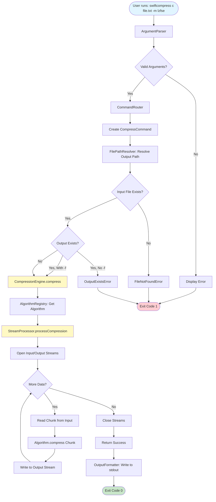
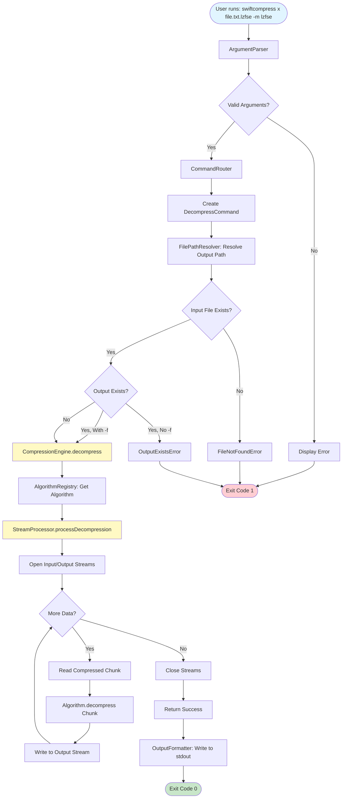
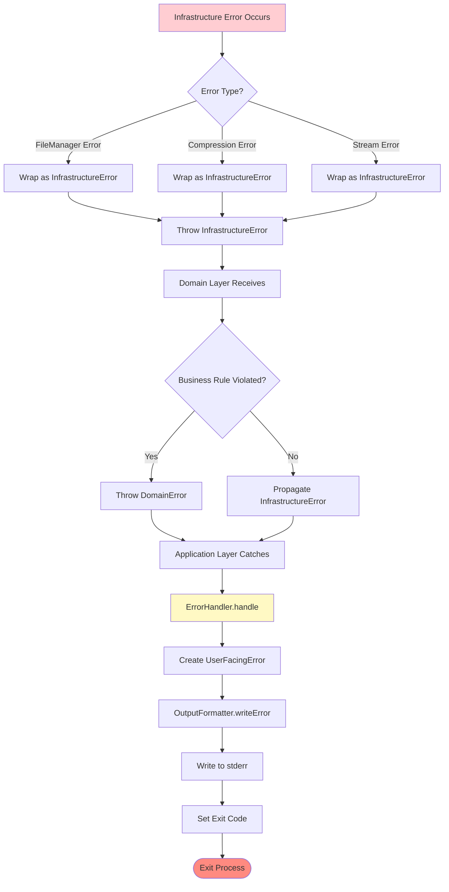
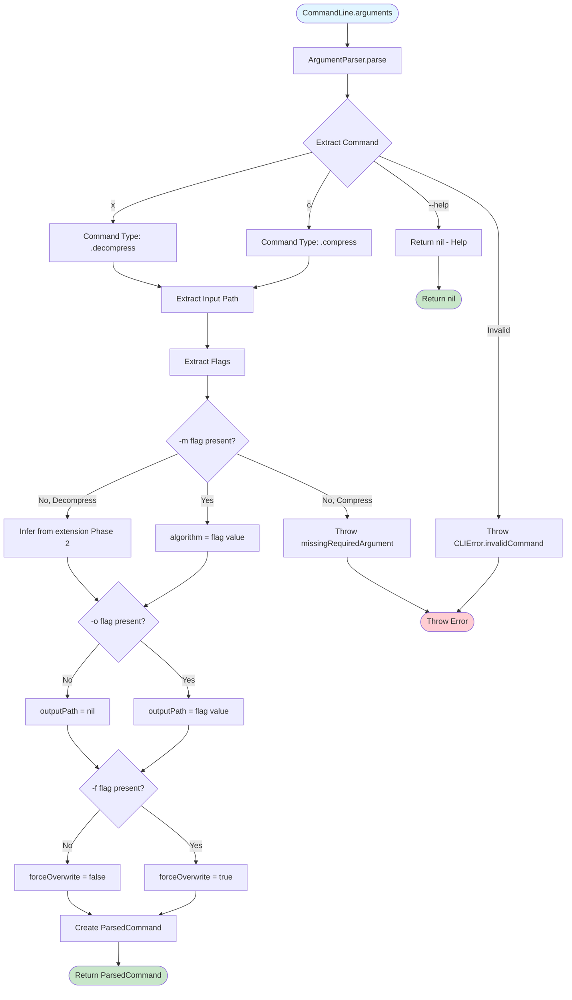
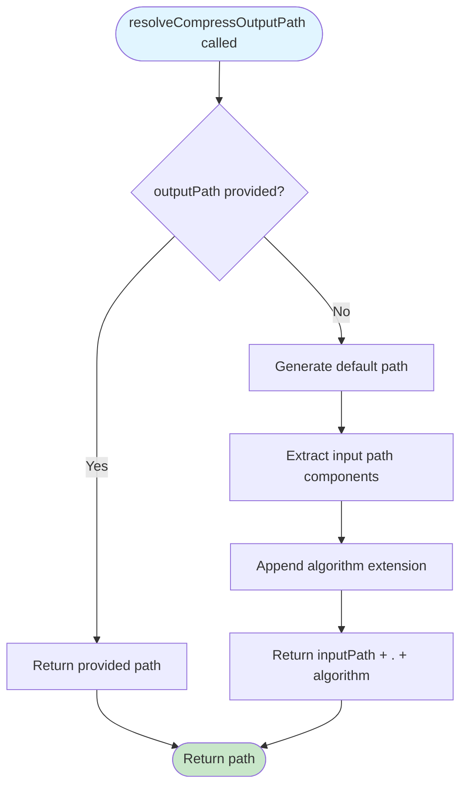
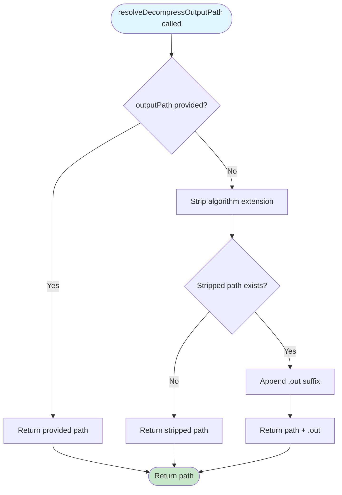
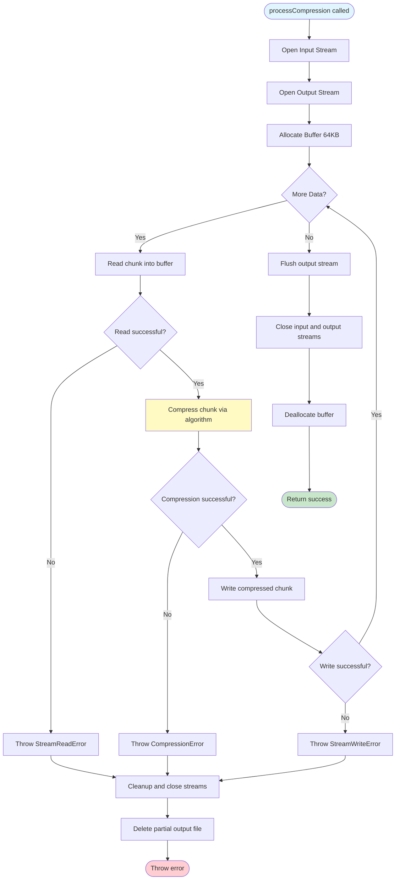

# SwiftCompress Data Flow Diagrams

**Version**: 1.0
**Last Updated**: 2025-10-07

This document provides detailed data flow diagrams for all major operations in SwiftCompress, illustrating how data moves through the system from user input to final output.

---

## Table of Contents

1. [Compression Flow](#compression-flow)
2. [Decompression Flow](#decompression-flow)
3. [Error Flow](#error-flow)
4. [Argument Parsing Flow](#argument-parsing-flow)
5. [File Path Resolution Flow](#file-path-resolution-flow)
6. [Stream Processing Flow](#stream-processing-flow)
7. [Algorithm Selection Flow](#algorithm-selection-flow)

---

## Compression Flow

### High-Level Compression Flow



### Detailed Compression Data Flow

```
┌─────────────────────────────────────────────────────────────────────┐
│                          User Input                                  │
│  Command: swiftcompress c /path/to/file.txt -m lzfse                │
└────────────────────────────┬────────────────────────────────────────┘
                             │
                             ▼
┌─────────────────────────────────────────────────────────────────────┐
│                      CLI Layer: main.swift                           │
│  1. Receives CommandLine.arguments                                   │
│  2. Invokes ArgumentParser.parse()                                   │
└────────────────────────────┬────────────────────────────────────────┘
                             │
                             ▼
┌─────────────────────────────────────────────────────────────────────┐
│                    CLI Layer: ArgumentParser                         │
│  Input:  ["swiftcompress", "c", "/path/to/file.txt", "-m", "lzfse"] │
│  Output: ParsedCommand(                                              │
│            commandType: .compress,                                   │
│            inputPath: "/path/to/file.txt",                           │
│            algorithmName: "lzfse",                                   │
│            outputPath: nil,                                          │
│            forceOverwrite: false                                     │
│          )                                                           │
└────────────────────────────┬────────────────────────────────────────┘
                             │
                             ▼
┌─────────────────────────────────────────────────────────────────────┐
│                    CLI Layer: CommandRouter                          │
│  1. Receives ParsedCommand                                           │
│  2. Creates CompressCommand with dependencies:                       │
│     - CompressionEngine                                              │
│     - FileHandler                                                    │
│     - FilePathResolver                                               │
│  3. Invokes command.execute()                                        │
└────────────────────────────┬────────────────────────────────────────┘
                             │
                             ▼
┌─────────────────────────────────────────────────────────────────────┐
│              Application Layer: CompressCommand.execute()            │
│  Step 1: Resolve Output Path                                        │
│    Input:  inputPath="/path/to/file.txt", outputPath=nil            │
│    Call:   pathResolver.resolveCompressOutputPath(...)              │
│    Output: "/path/to/file.txt.lzfse"                                │
│                                                                      │
│  Step 2: Validate Input File                                        │
│    Call:   fileHandler.fileExists("/path/to/file.txt")              │
│    Result: true (or throw FileNotFoundError)                        │
│                                                                      │
│  Step 3: Check Output File                                          │
│    Call:   fileHandler.fileExists("/path/to/file.txt.lzfse")        │
│    Result: false (or check forceOverwrite flag)                     │
│                                                                      │
│  Step 4: Invoke Compression                                         │
│    Call:   compressionEngine.compress(                              │
│              inputPath: "/path/to/file.txt",                         │
│              outputPath: "/path/to/file.txt.lzfse",                  │
│              algorithmName: "lzfse"                                  │
│            )                                                         │
└────────────────────────────┬────────────────────────────────────────┘
                             │
                             ▼
┌─────────────────────────────────────────────────────────────────────┐
│              Domain Layer: CompressionEngine.compress()              │
│  Step 1: Select Algorithm                                           │
│    Call:   algorithmRegistry.algorithm(named: "lzfse")              │
│    Result: LZFSEAlgorithm instance                                  │
│                                                                      │
│  Step 2: Invoke Stream Processing                                   │
│    Call:   streamProcessor.processCompression(                      │
│              input: InputStream("/path/to/file.txt"),               │
│              output: OutputStream("/path/to/file.txt.lzfse"),       │
│              algorithm: LZFSEAlgorithm,                              │
│              bufferSize: 65536                                       │
│            )                                                         │
└────────────────────────────┬────────────────────────────────────────┘
                             │
                             ▼
┌─────────────────────────────────────────────────────────────────────┐
│         Infrastructure: StreamProcessor.processCompression()         │
│                                                                      │
│  Step 1: Open Streams                                               │
│    inputStream.open()   // Opens file for reading                   │
│    outputStream.open()  // Opens file for writing                   │
│                                                                      │
│  Step 2: Processing Loop                                            │
│    ┌───────────────────────────────────────────────────────────┐   │
│    │ while inputStream.hasBytesAvailable:                       │   │
│    │   1. Read chunk (64 KB) from input stream                  │   │
│    │      buffer ← inputStream.read(65536)                      │   │
│    │                                                             │   │
│    │   2. Compress chunk via algorithm                          │   │
│    │      compressedChunk ← algorithm.compress(buffer)          │   │
│    │                                                             │   │
│    │   3. Write compressed chunk to output stream               │   │
│    │      outputStream.write(compressedChunk)                   │   │
│    └───────────────────────────────────────────────────────────┘   │
│                                                                      │
│  Step 3: Close Streams                                              │
│    inputStream.close()                                              │
│    outputStream.close()                                             │
│                                                                      │
│  Result: File "/path/to/file.txt.lzfse" created                     │
└────────────────────────────┬────────────────────────────────────────┘
                             │
                             ▼
┌─────────────────────────────────────────────────────────────────────┐
│         Infrastructure: LZFSEAlgorithm.compress(Data)                │
│  Uses Apple Compression Framework:                                  │
│    1. Initialize compression_stream with COMPRESSION_LZFSE          │
│    2. Process data through compression_stream_process()             │
│    3. Return compressed data                                        │
└────────────────────────────┬────────────────────────────────────────┘
                             │
                             ▼
┌─────────────────────────────────────────────────────────────────────┐
│              Application Layer: Return Success                       │
│  CompressCommand returns CommandResult.success(message: nil)        │
└────────────────────────────┬────────────────────────────────────────┘
                             │
                             ▼
┌─────────────────────────────────────────────────────────────────────┐
│                   CLI Layer: Handle Result                           │
│  1. Receives CommandResult.success                                  │
│  2. OutputFormatter writes nothing (quiet mode)                     │
│  3. exit(0)                                                          │
└─────────────────────────────────────────────────────────────────────┘
```

### Data Transformations During Compression

```
Original File (file.txt)
    │ Size: 100 KB
    │ Content: Plain text
    ▼
[Read in 64 KB chunks]
    │
    ├─> Chunk 1: 64 KB ──> [LZFSE Compress] ──> Compressed Chunk 1: ~20 KB
    │                                                   ▼
    │                                          [Write to output]
    │
    └─> Chunk 2: 36 KB ──> [LZFSE Compress] ──> Compressed Chunk 2: ~10 KB
                                                       ▼
                                               [Write to output]

Output File (file.txt.lzfse)
    Size: ~30 KB (70% compression ratio)
    Content: LZFSE compressed binary data
```

---

## Decompression Flow

### High-Level Decompression Flow



### Detailed Decompression Data Flow

```
┌─────────────────────────────────────────────────────────────────────┐
│                          User Input                                  │
│  Command: swiftcompress x /path/to/file.txt.lzfse -m lzfse          │
└────────────────────────────┬────────────────────────────────────────┘
                             │
                             ▼
┌─────────────────────────────────────────────────────────────────────┐
│              Application Layer: DecompressCommand.execute()          │
│  Step 1: Determine Algorithm                                        │
│    If algorithmName provided: use it                                │
│    Else: infer from extension (Phase 2)                             │
│    Result: "lzfse"                                                  │
│                                                                      │
│  Step 2: Resolve Output Path                                        │
│    Input:  inputPath="/path/to/file.txt.lzfse", outputPath=nil     │
│    Call:   pathResolver.resolveDecompressOutputPath(...)            │
│    Logic:  Strip ".lzfse" extension                                 │
│    Output: "/path/to/file.txt"                                      │
│                                                                      │
│  Step 3: Check Output Conflict                                      │
│    If "/path/to/file.txt" exists:                                   │
│      If forceOverwrite: proceed                                     │
│      Else: append ".out" → "/path/to/file.txt.out"                  │
│                                                                      │
│  Step 4: Invoke Decompression                                       │
│    Call:   compressionEngine.decompress(                            │
│              inputPath: "/path/to/file.txt.lzfse",                  │
│              outputPath: "/path/to/file.txt",                       │
│              algorithmName: "lzfse"                                 │
│            )                                                         │
└────────────────────────────┬────────────────────────────────────────┘
                             │
                             ▼
┌─────────────────────────────────────────────────────────────────────┐
│            Domain Layer: CompressionEngine.decompress()              │
│  Step 1: Select Algorithm                                           │
│    Call:   algorithmRegistry.algorithm(named: "lzfse")              │
│    Result: LZFSEAlgorithm instance                                  │
│                                                                      │
│  Step 2: Invoke Stream Processing                                   │
│    Call:   streamProcessor.processDecompression(                    │
│              input: InputStream("/path/to/file.txt.lzfse"),         │
│              output: OutputStream("/path/to/file.txt"),             │
│              algorithm: LZFSEAlgorithm,                              │
│              bufferSize: 65536                                       │
│            )                                                         │
└────────────────────────────┬────────────────────────────────────────┘
                             │
                             ▼
┌─────────────────────────────────────────────────────────────────────┐
│       Infrastructure: StreamProcessor.processDecompression()         │
│  Step 1: Open Streams                                               │
│    inputStream.open()   // Opens compressed file                    │
│    outputStream.open()  // Opens output file                        │
│                                                                      │
│  Step 2: Processing Loop                                            │
│    ┌───────────────────────────────────────────────────────────┐   │
│    │ while inputStream.hasBytesAvailable:                       │   │
│    │   1. Read compressed chunk from input                      │   │
│    │      compressedBuffer ← inputStream.read(65536)            │   │
│    │                                                             │   │
│    │   2. Decompress chunk via algorithm                        │   │
│    │      decompressedChunk ← algorithm.decompress(buffer)      │   │
│    │                                                             │   │
│    │   3. Write decompressed chunk to output                    │   │
│    │      outputStream.write(decompressedChunk)                 │   │
│    └───────────────────────────────────────────────────────────┘   │
│                                                                      │
│  Step 3: Close Streams                                              │
│    inputStream.close()                                              │
│    outputStream.close()                                             │
│                                                                      │
│  Result: File "/path/to/file.txt" created (original restored)       │
└─────────────────────────────────────────────────────────────────────┘
```

### Data Transformations During Decompression

```
Compressed File (file.txt.lzfse)
    │ Size: 30 KB
    │ Content: LZFSE compressed binary
    ▼
[Read in chunks]
    │
    ├─> Compressed Chunk 1: ~20 KB ──> [LZFSE Decompress] ──> Original Chunk 1: 64 KB
    │                                                                  ▼
    │                                                         [Write to output]
    │
    └─> Compressed Chunk 2: ~10 KB ──> [LZFSE Decompress] ──> Original Chunk 2: 36 KB
                                                                      ▼
                                                              [Write to output]

Output File (file.txt)
    Size: 100 KB (original size restored)
    Content: Plain text (original content restored)
```

---

## Error Flow

### Error Propagation Through Layers



### Detailed Error Flow Example

**Scenario**: File not found during compression

```
┌─────────────────────────────────────────────────────────────────────┐
│             Infrastructure Layer: FileSystemHandler                  │
│  func inputStream(at path: String) throws -> InputStream {          │
│      guard FileManager.default.fileExists(atPath: path) else {      │
│          throw InfrastructureError.fileNotFound(path: path)         │
│      }                                                               │
│      // ... create stream                                           │
│  }                                                                   │
└────────────────────────────┬────────────────────────────────────────┘
                             │ Throws: InfrastructureError.fileNotFound
                             ▼
┌─────────────────────────────────────────────────────────────────────┐
│           Domain Layer: StreamProcessor (catches and re-throws)      │
│  func processCompression(...) throws {                              │
│      do {                                                            │
│          let inputStream = try fileHandler.inputStream(at: path)    │
│      } catch let error as InfrastructureError {                     │
│          // Re-throw infrastructure errors                          │
│          throw error                                                 │
│      }                                                               │
│  }                                                                   │
└────────────────────────────┬────────────────────────────────────────┘
                             │ Throws: InfrastructureError.fileNotFound
                             ▼
┌─────────────────────────────────────────────────────────────────────┐
│           Application Layer: CompressCommand.execute()               │
│  func execute() throws -> CommandResult {                           │
│      do {                                                            │
│          try compressionEngine.compress(...)                        │
│          return .success(message: nil)                              │
│      } catch let error as InfrastructureError {                     │
│          return .failure(error: error)                              │
│      }                                                               │
│  }                                                                   │
└────────────────────────────┬────────────────────────────────────────┘
                             │ Returns: CommandResult.failure
                             ▼
┌─────────────────────────────────────────────────────────────────────┐
│              Application Layer: ErrorHandler.handle()                │
│  func handle(_ error: Error) -> UserFacingError {                   │
│      switch error {                                                  │
│      case InfrastructureError.fileNotFound(let path):               │
│          return UserFacingError(                                     │
│              message: "Error: File not found: \(path)",             │
│              exitCode: 1,                                            │
│              shouldPrintStackTrace: false                           │
│          )                                                           │
│      // ... other cases                                             │
│      }                                                               │
│  }                                                                   │
└────────────────────────────┬────────────────────────────────────────┘
                             │ Returns: UserFacingError
                             ▼
┌─────────────────────────────────────────────────────────────────────┐
│                CLI Layer: OutputFormatter.writeError()               │
│  func writeError(_ error: UserFacingError) {                        │
│      fputs("\(error.message)\n", stderr)                            │
│  }                                                                   │
└────────────────────────────┬────────────────────────────────────────┘
                             │ Output: "Error: File not found: /path"
                             ▼
┌─────────────────────────────────────────────────────────────────────┐
│                      CLI Layer: main.swift                           │
│  exit(userError.exitCode)  // Exit with code 1                      │
└─────────────────────────────────────────────────────────────────────┘
```

---

## Argument Parsing Flow

### Command-Line Argument Parsing



### Detailed Parsing Example

**Input**: `["swiftcompress", "c", "file.txt", "-m", "lzfse", "-o", "out.dat", "-f"]`

```
Step 1: Extract command
  arguments[1] = "c"
  → commandType = .compress

Step 2: Extract input path
  arguments[2] = "file.txt"
  → inputPath = "file.txt"

Step 3: Extract flags
  Iterate through remaining arguments:
    arguments[3] = "-m"
    arguments[4] = "lzfse"
    → algorithmName = "lzfse"

    arguments[5] = "-o"
    arguments[6] = "out.dat"
    → outputPath = "out.dat"

    arguments[7] = "-f"
    → forceOverwrite = true

Step 4: Create ParsedCommand
  ParsedCommand(
    commandType: .compress,
    inputPath: "file.txt",
    algorithmName: "lzfse",
    outputPath: "out.dat",
    forceOverwrite: true
  )
```

---

## File Path Resolution Flow

### Output Path Resolution for Compression



**Example**:
```
Input:  inputPath="/path/to/file.txt", algorithm="lzfse", outputPath=nil
Output: "/path/to/file.txt.lzfse"

Input:  inputPath="/path/to/file.txt", algorithm="lz4", outputPath="/custom/output.bin"
Output: "/custom/output.bin"
```

### Output Path Resolution for Decompression



**Example**:
```
Input:  inputPath="/path/to/file.txt.lzfse", algorithm="lzfse", outputPath=nil
Check:  "/path/to/file.txt" does not exist
Output: "/path/to/file.txt"

Input:  inputPath="/path/to/file.txt.lzfse", algorithm="lzfse", outputPath=nil
Check:  "/path/to/file.txt" exists
Output: "/path/to/file.txt.out"
```

---

## Stream Processing Flow

### Stream-Based Compression Processing



### Buffer Management During Streaming

```
Memory Layout During Stream Processing:

┌────────────────────────────────────────────────────────────┐
│                    Memory (RAM)                             │
├────────────────────────────────────────────────────────────┤
│                                                             │
│  Input Buffer (64 KB)          Output Buffer (variable)    │
│  ┌─────────────────┐          ┌──────────────────┐        │
│  │ [Chunk from     │          │ [Compressed      │        │
│  │  input file]    │  ──────> │  chunk ready     │ ───┐   │
│  │                 │          │  to write]       │    │   │
│  └─────────────────┘          └──────────────────┘    │   │
│         ▲                              │               │   │
│         │                              ▼               │   │
│         │                        Write to disk        │   │
│    Read from disk                      │               │   │
│         │                              │               │   │
└─────────┼──────────────────────────────┼───────────────┼───┘
          │                              │               │
          │                              │               │
   ┌──────▼─────────┐            ┌──────▼───────────┐   │
   │  Input File    │            │  Output File     │◄──┘
   │  (on disk)     │            │  (being written) │
   │  100 MB        │            │                  │
   └────────────────┘            └──────────────────┘

Total RAM Usage: ~64 KB + compressed chunk size (typically < 64 KB)
                 = ~100-150 KB maximum
```

---

## Algorithm Selection Flow

### Algorithm Registry Lookup

```mermaid
flowchart TD
    Start([algorithm named: "lzfse"]) --> Normalize[Normalize to lowercase]
    Normalize --> Lookup{Algorithm in registry?}

    Lookup -->|Yes| Return[Return algorithm instance]
    Lookup -->|No| Nil[Return nil]

    Return --> Engine[CompressionEngine uses algorithm]
    Nil --> Error[Caller throws DomainError.invalidAlgorithmName]

    Engine --> Success([Compression proceeds])
    Error --> Fail([Operation fails])

    style Start fill:#e1f5ff
    style Success fill:#c8e6c9
    style Fail fill:#ffcdd2
```

### Algorithm Registration at Startup

```
main.swift Execution:

1. Create AlgorithmRegistry
   registry = AlgorithmRegistry()

2. Create algorithm instances
   lzfse = LZFSEAlgorithm()
   lz4 = LZ4Algorithm()
   zlib = ZlibAlgorithm()
   lzma = LZMAAlgorithm()

3. Register algorithms
   registry.register(lzfse)   // Stores as "lzfse" → LZFSEAlgorithm
   registry.register(lz4)     // Stores as "lz4" → LZ4Algorithm
   registry.register(zlib)    // Stores as "zlib" → ZlibAlgorithm
   registry.register(lzma)    // Stores as "lzma" → LZMAAlgorithm

4. Inject registry into CompressionEngine
   engine = CompressionEngine(algorithmRegistry: registry, ...)

Registry State:
{
  "lzfse": LZFSEAlgorithm instance,
  "lz4": LZ4Algorithm instance,
  "zlib": ZlibAlgorithm instance,
  "lzma": LZMAAlgorithm instance
}

Later during compression:
algorithm = registry.algorithm(named: "lzfse")
// O(1) dictionary lookup
// Returns: LZFSEAlgorithm instance
```

---

## Complete End-to-End Flow Summary

### Successful Compression Operation

```
User Input
    ↓
ArgumentParser (CLI Layer)
    ↓
CommandRouter (CLI Layer)
    ↓
CompressCommand (Application Layer)
    ├─> FilePathResolver (Domain Layer)
    ├─> FileHandler (Infrastructure Layer)
    └─> CompressionEngine (Domain Layer)
            ├─> AlgorithmRegistry (Domain Layer)
            └─> StreamProcessor (Infrastructure Layer)
                    ├─> Algorithm (Infrastructure Layer)
                    └─> FileHandler (Infrastructure Layer)
    ↓
Success Result
    ↓
OutputFormatter (CLI Layer)
    ↓
Exit Code 0
```

### Failed Operation (File Not Found)

```
User Input
    ↓
ArgumentParser (CLI Layer)
    ↓
CommandRouter (CLI Layer)
    ↓
CompressCommand (Application Layer)
    ↓
FileHandler.fileExists() → false (Infrastructure Layer)
    ↓
Throw InfrastructureError.fileNotFound
    ↓
CompressCommand catches error
    ↓
Return CommandResult.failure
    ↓
ErrorHandler.handle() (Application Layer)
    ↓
UserFacingError created
    ↓
OutputFormatter.writeError (CLI Layer)
    ↓
stderr: "Error: File not found: /path"
    ↓
Exit Code 1
```

---

## Performance Characteristics

### Time Complexity

| Operation | Complexity | Notes |
|-----------|------------|-------|
| Argument Parsing | O(n) | n = number of arguments (typically < 10) |
| Algorithm Lookup | O(1) | Dictionary-based registry |
| File Reading | O(m/b) | m = file size, b = buffer size (64 KB) |
| Compression | O(m) | m = file size (algorithm-dependent) |
| File Writing | O(m/b) | m = compressed size |

### Space Complexity

| Component | Space Usage | Notes |
|-----------|-------------|-------|
| Argument Parser | O(1) | Fixed-size structures |
| Algorithm Registry | O(a) | a = number of algorithms (4 in MVP) |
| Stream Buffers | O(b) | b = buffer size (64 KB) |
| Total Runtime | O(1) | Constant, regardless of file size |

---

This comprehensive data flow documentation provides implementation teams with clear understanding of how data moves through the SwiftCompress system, enabling effective implementation and debugging.
